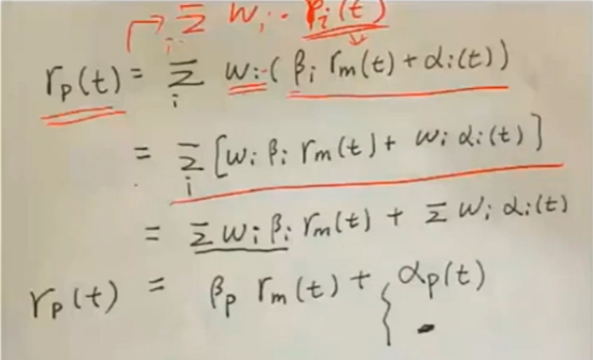
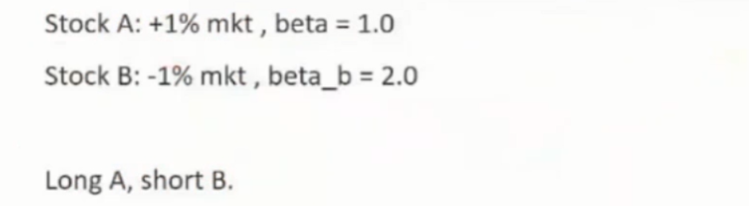
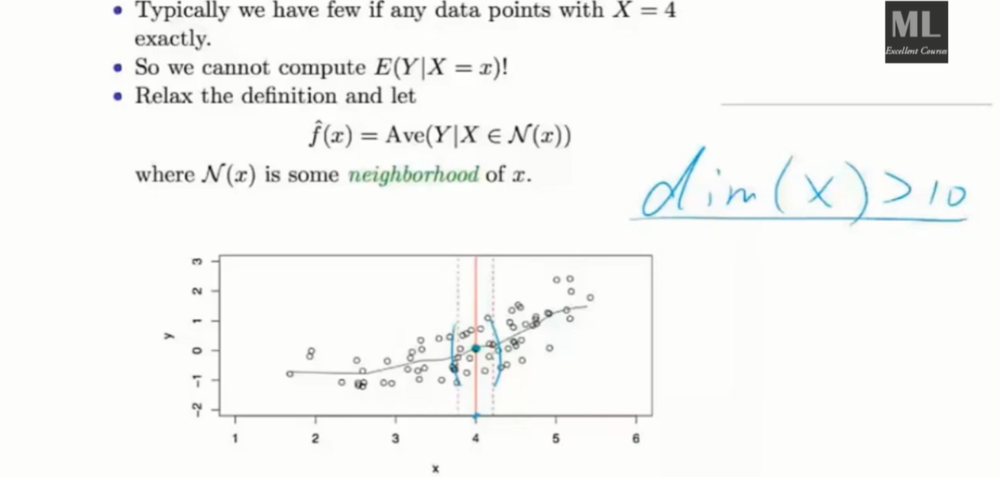
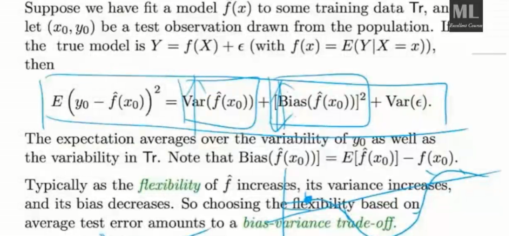
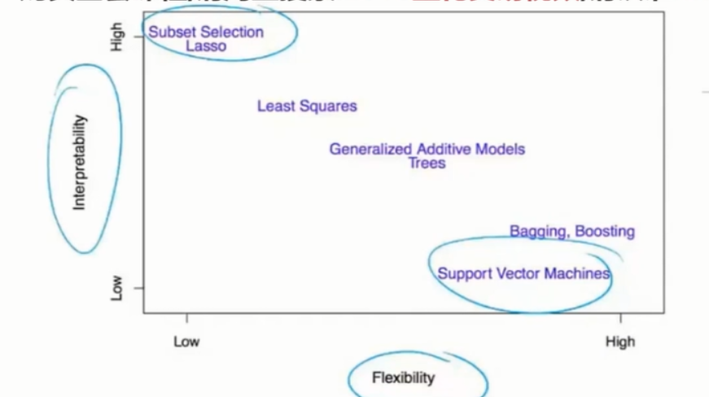

#机器学习与量化交易系列课程（二）

问题：

1、如何画一个股票的热力图，stackoverflow

2、利用sklearn在minist数据上做分类

3、利用sklearn做线性回归模型

4、利用优矿画出个股收益率和沪深三百的收益率关系，线性拟合

5、APT有点没听懂，还需要再学习

6、element's of statistical learning   统计学习的圣经

第二节课的任务

​	掌握python语言和常用数据处理包；

​	从技术分析到机器学习

下次课的任务（任务比较多，需要至少5~8小时的编程量）

​	实战1：python爬取金融数据，建立自己的数据库

​	实战2：利用python进行金融数据处理：数据处理，数据可视化，特征提取；

​	实战3：你的第一个基于机器学习的量化模型

##课前准备

#### 1、主要平台

​	anaconda的安装

​	ipython notebook

​	首选linux

#### 2、需要自学掌握的python知识点

​	python的数据类型：str，float ， bool， int，long

​	python 的基本语法：分支，循环，函数

​	python的数据结构：tuple**,list,dictionary**,etc

​	python的内置函数???

​	python和面向对象编程

自学地址：https://learnxinyminutes.com/docs/python/

#### 3、需要自学掌握的numpy的知识点

​	利用numpy进行各类线性代数的运算：

​		1、创建矩阵，向量，etc

​		2、熟练掌握矩阵的索引（**这个是重点，需要非常自如**）

​	numpy的输入和输出

​	numpy的常用函数

自学地址：书籍《利用python进行数据分析》第四章

#### 4、需要自学掌握的pandas的知识点

​	pandas与数据io

​	pandas的dataframe的各种函数（统计指标，绘图）

​	pandas的索引

pandas的效率比numpy要高，需要熟练掌握内置函数

当写一个函数之前，要充分利用Google资源（Stack Overflow）

自学地址：书籍《利用python进行数据分析》第五章

#### 5、需要自学掌握的sklearn的知识点

​	利用sklearn在minist数据上做分类

​	利用sklearn做线性回归模型

除了深度学习和强化学习，基本上其他传统的机器学习算法，sklearn都已经写好了

并且sklearn里面的模型都必须是在论文上发表过的，而且是引用数超过200的文章。

自学地址：http://scikit-learn.org/stable/auto_examples/index.html

## CAPM  model

protfolio（资产组合）

[a%,b%,c%]

并且 abs(a%)+abs(b%)+abs(c%)=100%

市场的protfolio

​	SP500,沪深300

#### **个股的CAPM model**

​	r~i~(t)  = beta~i~ * r~m~(t) + alpha~i~(t)

对于股票i，股票在t的收益r~i~(t) 等于市场的回报r~m~(t)乘以beta+一个残差

并且对于有效市场假说，E(alpha(t)) = 0

通俗地讲就是：个股的收益跟股票的大盘呈一个线性的关系，当然有一些小的扰动，

每一个股都有自己的alpha和beta。

但是这只是理论上的一个模型，实际上的市场肯定不是线性的。

#### **被动式管理和主动式管理基金**

​	被动式管理：复制大盘指数，持有；

​	主动式管理：选择个股，频繁交易；

关键分歧：alpha是否随机噪声，alpha的期望值是否为0。

投资组合的CAPM model

几个推论：

​	1、E(alpha) = 0;

​	2、选择好的beta值：牛市时，要选择一个比大盘大的beta；熊市时，要选择一个比大盘小的beta，比大盘跌的少。

​	3、如果市场有效假说成立，那么我们无法预测股市，也选择不出来合适的beta.

##价格套利理论（APT）

​	r~i~(t)  = beta~i~ * r~m~(t) + alpha~i~(t)

但是beta不是常数，而是一个变量。beta = w * r。

然后推算出A,B的比例

技术分析和基本面分析

技术分析相信历史数据：

​	价格，交易量----->计算指标------->启发式选择

**技术分析什么时候有用？**

​	多个指标的非线性组合（机器学习）

​	短时（微观尺度，顶多到天）

​	异类监测（能找到和大盘不一致的股票，只有不一致时才有机会套利）

## 最基本的指标以及机器学习怎么介入

#### 1、Momentum(动量线)： 

​	mom[t] = price[t] / (price[t-n])  - 1

  	 n是一个超参数，可以获得不同的输入

#### 2、SMA（简单的移动平均） 

:Simple moving average.(smooth,laggged)... 可以看做一种滤波器。

​	一个时刻的移动平均值是上几个时刻的平均值，有的交易员把移动平均值看做股票的内在价格，如果此时实际价格大于内在价格，则卖出股票。

均线的的问题是，没有考虑到价格的波动性，当波动性较大时，策略就会被频繁触发。

#### 3、BB（bollinger bands） boll指标：

决策边界是时间序列的两个标准差，这样模型具有更好的鲁棒性。

#### 4、参数的归一化：

​	比如：SMA的取值范围是-0.5 ~ 0.5；Mom的取值范围是-0.5 ~ 0.5；BB ~（-1,1），如果要同时用到以上三个参数，那么需要归一化，归一化的方法是：

​	norm = (value - mean) / values.std()

#### 5、如何得到 y = f(SMA,BB,Mom) ?

​	如果是一维的变量（x,y都是一维的），课程举例是KNN(最近邻算法)

假设当x = 5.7时，y=0.6,.07.0.8.那么下一个x=5.7过来时，我们预测y = 0.7(前几个y的均值)

在高维模型中，使用KNN，容易产生维数灾难

​	如果是多维输入，如果是线性，多元线性回归；

​	非线性的话那么就采用神经网络，或者SVM求出来

#### 6、bias- variance trade-off

当一个模型，在一个数据集上训练得很好，bias很小，那么换到另一个数据集上后，variance是很大的，这在理论上可以证明是此消彼长的，模型的泛化能力就是想追求一种平衡。

element's of statistical learning

模型的复杂度与可解释性

