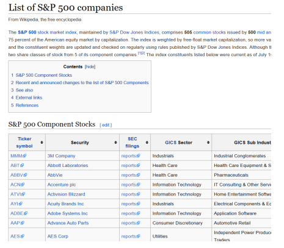
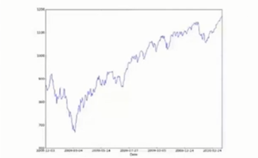
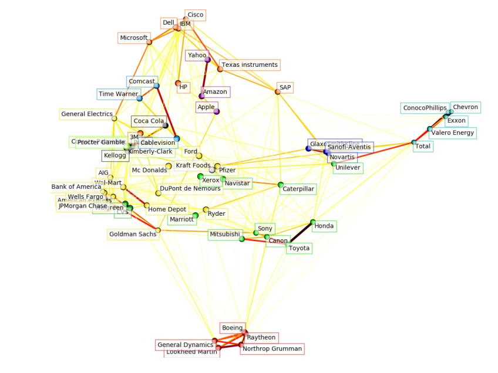
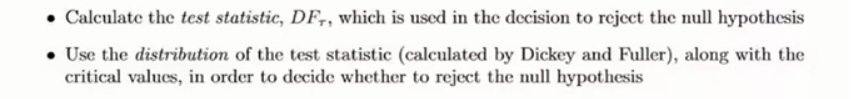
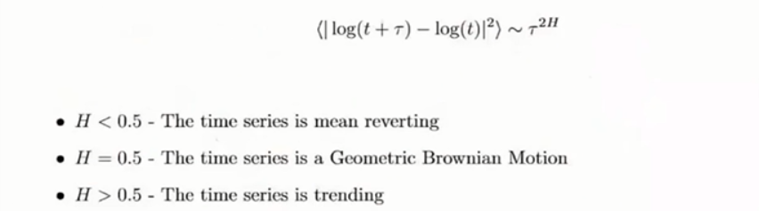
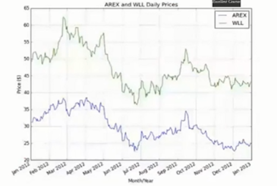
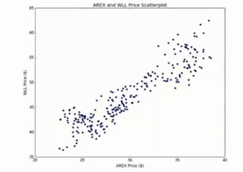

# 机器学习与量化交易系列课程（三）

课下的任务：

1、建立自己的数据库，关系型数据库？

2、学习beautifulsoap ,看一看相关介绍

3、p-value , t检验


《learn python  the hard way》

课程内容：

​	数据的获得与存储

​	时间序列分析实战


## 建立数据库的意义

1、建模

​	模型建立，模型评估，模型回测，风险控制

如果是一个团队，这几个步骤都有人做，但是如果单干，需要每个步骤都知道

2、交易


## 数据的获取

http://tushare.org/index.html

关于中国的财经数据，用tushare，分配硬盘差不多4~6个T

Yahoo Finance  -http://finance.yahoo.com

google finance -https://www.google.com/finance

quantquote(S&P500 EOD data only) - https://www.quantquote.com

EODData(需要注册) - http://eoddata.com

(EOD:End of day  日交易数据)


## 数据的存储方式

CSV表格，NoSQL，SQL

文本类数据（Nosql或者mangoDB）,时间序列有关的数据（sql）


数据格式

​	交易所信息(纳斯达克？上交所)

​	数据来源（通联数据，雅虎金融？）

​	ticker/symbol（苹果，google?）

​	价格

​	企业行为（stock splits/dividend adjustments）,比如除权

需要用spike   filter,或者缺失数据，用pandas处理

​	国家假日,需要剔除


搭建自己的mysql

安装,然后看一点**关系型数据库**的知识

```python
sudo apt-get install mysql-server
mysql -u root -p

mysql> CREATE DATABASE securities_master;
mysql> USE securities_master;

mysql> CREATE USER 'sec_user'@'localhost' IDENTIFIED BY 'password';
mysql> GRANT ALL PRIVILEGES ON securities_master.* TO 'sec_user'@'localhost'
mysql> FLUSH PRIVILEGES
```


设计股票EOD数据的表

exchange,

Datavendor(数据源),

symblol,

Dailyprice

```python
CREATE TABLE `exchange` (
  `id` int NOT NULL AUTO_INCREMENT,
  `abbrev` varchar(32) NOT NULL,
  `name` varchar(255) NOT NULL,
  `city` varchar(255) NULL,
  `country` varchar(255) NULL,
  `currency` varchar(64) NULL,
  `timezone_offset` time NULL,
  `created_date` datetime NOT NULL,
  `last_updated_date` datetime NOT NULL,
  PRIMARY KEY (`id`)
) ENGINE=InnoDB AUTO_INCREMENT=1 DEFAULT CHARSET=utf8;
```

```python
CREATE TABLE `data_vendor` (
  `id` int NOT NULL AUTO_INCREMENT,
  `name` varchar(64) NOT NULL,
  `website_url` varchar(255) NULL,
  `support_email` varchar(255) NULL,
  `created_date` datetime NOT NULL,
  `last_updated_date` datetime NOT NULL,
  PRIMARY KEY (`id`)
) ENGINE=InnoDB AUTO_INCREMENT=1 DEFAULT CHARSET=utf8;
```

```python
CREATE TABLE `symbol` (
  `id` int NOT NULL AUTO_INCREMENT,
  `exchange_id` int NULL,
  `ticker` varchar(32) NOT NULL,
  `instrument` varchar(64) NOT NULL,
  `name` varchar(255) NULL,
  `sector` varchar(255) NULL,
  `currency` varchar(32) NULL,
  `created_date` datetime NOT NULL,
  `last_updated_date` datetime NOT NULL,
  PRIMARY KEY (`id`),
  KEY `index_exchange_id` (`exchange_id`)
) ENGINE=InnoDB AUTO_INCREMENT=1 DEFAULT CHARSET=utf8;
```

```python
CREATE TABLE `daily_price` (
  `id` int NOT NULL AUTO_INCREMENT,
  `data_vendor_id` int NOT NULL,
  `symbol_id` int NOT NULL,
  `price_date` datetime NOT NULL,
  `created_date` datetime NOT NULL,
  `last_updated_date` datetime NOT NULL,
  `open_price` decimal(19,4) NULL,
  `high_price` decimal(19,4) NULL,
  `low_price` decimal(19,4) NULL,
  `close_price` decimal(19,4) NULL,
  `adj_close_price` decimal(19,4) NULL,
  `volume` bigint NULL,
  PRIMARY KEY (`id`),
  KEY `index_data_vendor_id` (`data_vendor_id`),
  KEY `index_symbol_id` (`symbol_id`)
) ENGINE=InnoDB AUTO_INCREMENT=1 DEFAULT CHARSET=utf8;
```

 

python 同数据库连接

```python
sudo apt-get install libmysqlclient-dev
pip install mysqlclient
```

任务：

从a处(比如维基百科)获得股票symbol，从b处（比如雅虎金融）获得相应的价格，存在某处。

并且将来可以随时读取。




目的：会用python的beautiful soup

insert_symbols.py

```python
#!/usr/bin/python
# -*- coding: utf-8 -*-

# insert_symbols.py

from __future__ import print_function

import datetime
from math import ceil

import bs4
import MySQLdb as mdb
import requests


def obtain_parse_wiki_snp500():
    """
    Download and parse the Wikipedia list of S&P500 
    constituents using requests and BeautifulSoup.

    Returns a list of tuples for to add to MySQL.
    """
    # Stores the current time, for the created_at record
    now = datetime.datetime.utcnow()

    # Use requests and BeautifulSoup to download the 
    # list of S&P500 companies and obtain the symbol table
    response = requests.get(
        "http://en.wikipedia.org/wiki/List_of_S%26P_500_companies"
    )
    soup = bs4.BeautifulSoup(response.text)

    # This selects the first table, using CSS Selector syntax
    # and then ignores the header row ([1:])
    symbolslist = soup.select('table')[0].select('tr')[1:]

    # Obtain the symbol information for each 
    # row in the S&P500 constituent table
    symbols = []
    for i, symbol in enumerate(symbolslist):
        tds = symbol.select('td')
        symbols.append(
            (
                tds[0].select('a')[0].text,  # Ticker
                'stock', 
                tds[1].select('a')[0].text,  # Name
                tds[3].text,  # Sector
                'USD', now, now
            ) 
        )
    return symbols


def insert_snp500_symbols(symbols):
    """
    Insert the S&P500 symbols into the MySQL database.
    """
    # Connect to the MySQL instance
    db_host = 'localhost'
    db_user = 'sec_user'
    db_pass = 'password'
    db_name = 'securities_master'
    con = mdb.connect(
        host=db_host, user=db_user, passwd=db_pass, db=db_name
    )

    # Create the insert strings
    column_str = """ticker, instrument, name, sector, 
                 currency, created_date, last_updated_date
                 """
    insert_str = ("%s, " * 7)[:-2]
    final_str = "INSERT INTO symbol (%s) VALUES (%s)" % \
        (column_str, insert_str)

    # Using the MySQL connection, carry out 
    # an INSERT INTO for every symbol
    with con: 
        cur = con.cursor()
        cur.executemany(final_str, symbols)


if __name__ == "__main__":
    symbols = obtain_parse_wiki_snp500()
    insert_snp500_symbols(symbols)
    print("%s symbols were successfully added." % len(symbols))
```

Price_retrivel.py

```python
#!/usr/bin/python
# -*- coding: utf-8 -*-

# price_retrieval.py

from __future__ import print_function

import datetime
import warnings

import MySQLdb as mdb
import requests


# Obtain a database connection to the MySQL instance
db_host = 'localhost'
db_user = 'sec_user'
db_pass = 'password'
db_name = 'securities_master'
con = mdb.connect(db_host, db_user, db_pass, db_name)


def obtain_list_of_db_tickers():
    """
    Obtains a list of the ticker symbols in the database.
    """
    with con: 
        cur = con.cursor()
        cur.execute("SELECT id, ticker FROM symbol")
        data = cur.fetchall()
        return [(d[0], d[1]) for d in data]


def get_daily_historic_data_yahoo(
        ticker, start_date=(2000,1,1),
        end_date=datetime.date.today().timetuple()[0:3]
    ):
    """
    Obtains data from Yahoo Finance returns and a list of tuples.

    ticker: Yahoo Finance ticker symbol, e.g. "GOOG" for Google, Inc.
    start_date: Start date in (YYYY, M, D) format
    end_date: End date in (YYYY, M, D) format
    """
    # Construct the Yahoo URL with the correct integer query parameters
    # for start and end dates. Note that some parameters are zero-based!
    ticker_tup = (
        ticker, start_date[1]-1, start_date[2], 
        start_date[0], end_date[1]-1, end_date[2], 
        end_date[0]
    )
    yahoo_url = "http://ichart.finance.yahoo.com/table.csv"
    yahoo_url += "?s=%s&a=%s&b=%s&c=%s&d=%s&e=%s&f=%s"
    yahoo_url = yahoo_url % ticker_tup

    # Try connecting to Yahoo Finance and obtaining the data
    # On failure, print an error message.
    try:
        yf_data = requests.get(yahoo_url).text.split("\n")[1:-1]
        prices = []
        for y in yf_data:
            p = y.strip().split(',')
            prices.append( 
                (datetime.datetime.strptime(p[0], '%Y-%m-%d'),
                p[1], p[2], p[3], p[4], p[5], p[6]) 
            )
    except Exception as e:
        print("Could not download Yahoo data: %s" % e)
    return prices


def insert_daily_data_into_db(
        data_vendor_id, symbol_id, daily_data
    ):
    """
    Takes a list of tuples of daily data and adds it to the
    MySQL database. Appends the vendor ID and symbol ID to the data.

    daily_data: List of tuples of the OHLC data (with 
    adj_close and volume)
    """
    # Create the time now
    now = datetime.datetime.utcnow()

    # Amend the data to include the vendor ID and symbol ID
    daily_data = [
        (data_vendor_id, symbol_id, d[0], now, now,
        d[1], d[2], d[3], d[4], d[5], d[6]) 
        for d in daily_data
    ]

    # Create the insert strings
    column_str = """data_vendor_id, symbol_id, price_date, created_date, 
                 last_updated_date, open_price, high_price, low_price, 
                 close_price, volume, adj_close_price"""
    insert_str = ("%s, " * 11)[:-2]
    final_str = "INSERT INTO daily_price (%s) VALUES (%s)" % \
        (column_str, insert_str)

    # Using the MySQL connection, carry out an INSERT INTO for every symbol
    with con: 
        cur = con.cursor()
        cur.executemany(final_str, daily_data)


if __name__ == "__main__":
    # This ignores the warnings regarding Data Truncation
    # from the Yahoo precision to Decimal(19,4) datatypes
    warnings.filterwarnings('ignore')

    # Loop over the tickers and insert the daily historical
    # data into the database
    tickers = obtain_list_of_db_tickers()
    lentickers = len(tickers)
    for i, t in enumerate(tickers):
        print(
            "Adding data for %s: %s out of %s" % 
            (t[1], i+1, lentickers)
        )
        yf_data = get_daily_historic_data_yahoo(t[1])
        insert_daily_data_into_db('1', t[0], yf_data)
    print("Successfully added Yahoo Finance pricing data to DB.")
```

Retrieving_data.py

```python 
#!/usr/bin/python
# -*- coding: utf-8 -*-

# retrieving_data.py

from _future_ import print_function
import pandas as pd 
import MySQLdb as mdb

if _name_ =="_main_":
  # connect to the Mysql instance
  db_host = 'localhost'
  db_user = 'sec_user'
  db_pass = 'password'
  db_name ='securities_master'
  con = mdb.connect(db_host,db_user,db_pass,db_name)
  
  # select all of the historic google adjusted close data 
  sql = """
  select dp.price_date,dp.adj_close_price
  from symbol as sym
  inner join daily_price as dp
  on dp.symbol id =sym.id
  where sym.ticker = 'GOOG'
  ORDER BY dp.price_data ASC;
  """
  # Create apandans dataframe from the SQL query
  goog = pd.read_sql_query(sql,con-con,index_col-'price_date')
  
  #output the dataframe tail
  print(goog.tail())
```

```python
# 直接从pandas获取数据，和上面的函数功能一致
# pandas内置函数，可以获得spy和雅虎的数据
from __future__ import print_function
import datetime
import pandas.io.data as web

if _name_ =="_main_":
  spy = web.DataReader(
  	"SPY","yahoo",
    datetime.datetime(2007.1.1),
    datetime.datetime(2015,6,15)
  )
  print(spy.tail())
```

Quandl需要注册

quandl_data.py

```python
#!/usr/bin/python
# -*- coding: utf-8 -*-

# quandl_data.py

from __future__ import print_function

import matplotlib.pyplot as plt
import pandas as pd
import requests


def construct_futures_symbols(
        symbol, start_year=2010, end_year=2014
    ):
    """
    Constructs a list of futures contract codes 
    for a particular symbol and timeframe.
    """
    futures = []
    # March, June, September and 
    # December delivery codes
    months = 'HMUZ' 
    for y in range(start_year, end_year+1):
        for m in months:
            futures.append("%s%s%s" % (symbol, m, y))
    return futures


def download_contract_from_quandl(contract, dl_dir):
    """
    Download an individual futures contract from Quandl and then
    store it to disk in the 'dl_dir' directory. An auth_token is 
    required, which is obtained from the Quandl upon sign-up.
    """
    # Construct the API call from the contract and auth_token 
    api_call = "http://www.quandl.com/api/v1/datasets/"   
    api_call += "OFDP/FUTURE_%s.csv" % contract
    # If you wish to add an auth token for more downloads, simply
    # comment the following line and replace MY_AUTH_TOKEN with
    # your auth token in the line below
    params = "?sort_order=asc"
    #params = "?auth_token=MY_AUTH_TOKEN&sort_order=asc"
    full_url = "%s%s" % (api_call, params)

    # Download the data from Quandl
    data = requests.get(full_url).text
    
    # Store the data to disk
    fc = open('%s/%s.csv' % (dl_dir, contract), 'w')
    fc.write(data)
    fc.close()


def download_historical_contracts(
        symbol, dl_dir, start_year=2010, end_year=2014
    ):
    """
    Downloads all futures contracts for a specified symbol
    between a start_year and an end_year.
    """
    contracts = construct_futures_symbols(
        symbol, start_year, end_year
    )
    for c in contracts:
        print("Downloading contract: %s" % c)
        download_contract_from_quandl(c, dl_dir)


if __name__ == "__main__":
    symbol = 'ES'

    # Make sure you've created this 
    # relative directory beforehand
    dl_dir = 'quandl/futures/ES'

    # Create the start and end years
    start_year = 2010
    end_year = 2014

    # Download the contracts into the directory
    download_historical_contracts(
        symbol, dl_dir, start_year, end_year
    )

    # Open up a single contract via read_csv 
    # and plot the settle price
    es = pd.io.parsers.read_csv(
        "%s/ESH2010.csv" % dl_dir, index_col="Date"
    )
    es["Settle"].plot()
    plt.show()
```

大致效果如下：



#### 作业1

利用http://tushare.org/index.html中介绍的api，爬取http://tushare.org/trading.html页面中的所有关于交易数据存入本地数据库（CSV文件夹）

hint：参考http://tushare.org/storing.html

目的：学会调用api ，能够区分一些市面上已有的平台所提供的的API的优缺点，根据任务，知道什么时候可以用云端，什么时候该把数据存到本地

#### 作业2

对沪深三百股票进行聚类，并画出下图所示的二维嵌入

点是股票，边是相似度(也可以自己定义一个核函数)




hint：http://scikit-learn.org/stable/auto_examples/applications/plot_stock_market.html#stock-market

目的：学会将数据可视化，sklearn中有很大的精力都在画图，然后将自己的数据库用sklearn画出来。当然，聚类方法可以进行二次修改，


## 时间序列分析

tushare上的文本类数据还是值得一做的；

假设大家能存数据，读数据之后，立马能做的事情就是时间序列分析

时间序列分析可以在很少的数据点做实验，所以需要用一些统计学的方法做检测，但是机器学习因为数据量很大，所以在验证集上做回测之后就可以视为已验证了。

均值回归：金融产品的价格在某一个值左右波动；

随机游走：股票上一刻的价格跟下一刻没有关系，是独立的，不可预测的，基本上单只股票的价格都是随机游走的，但是投资组合有办法找到不是随机游走的策略（属于统计套利）

Mean Reversion and ornstein-uhlenbeck process


o-u 过程，θ代表回归到mean值的速率，μ是均值，σ是方差,W是维纳过程或者布朗运动。

时间序列价格的波动，正比于价格和均值的差，再加上一个随机噪声;

**判定时间序列是否平稳**	

​	1、ADF Test: unit root in autoregressive time series.



```python
pip install stasmodels

# download the amazon CHLCV data from 1/1/2000 to 1/1/2015
amzn = web.DataReader("AMZN","yahoo",datatime(2000,1,1),datatime(2015,1,1))
# output the results of the augmented Dickey-Fuller test for Amazon
# with a lag order value of 1
ts.adfuller(amzn['Adj Close']),1
```

​	2、Hurst Exponent



```python
def hurst(ts):
  """return the hursts exponent of the time series vector ts"""
  # create the range of lag value 
  lags = range(2,100)
  
  # calculate the array of the variances of the lagged differences
  tau = [sqrt(std(subtract(ts[lag:],ts[:-lag]))) for lag in lags]
  
  # use a linear fit to estimate the hurst exponent
  poly = polyfit(log(lags),log(tau),1)
  
  # return the hurst exponet from the polyfit output
  return poly[0]*2.0

# create a gometric brownian motion ,mean-reverting and trending series
gbm =log(cumsum(randn(100000))+1000)
mr = log(rondn(100000)+1000)
tr = log(cumsum(randn(100000)+1)+1000)

# output the hurst exponent for each of the above series
# and the price of amazon(the adjusted colse price) for
# the ADF rest given above in the article
print("Hurst(GBM) :   %s" % hurst(gbm))
print("Hurst(MR) :   %s" % hurst(mr))
print("Hurst(TR) :   %s" % hurst(tr))
# Assuming you have run the above code to obtain 'amazn'!
print("Hurst(AMZN) :   %s" % hurst(amzn['Adj Close']))
```

#### 作业3

**测试均值回复数据**

分别对沪深三百股票进行上述两者统计监测（2010~2015），并汇报出具备mean-reverting的股票（如果存在的话）


从单一股票到投资组合

cointegrated augmented Dickey-fuller Test

​	y(t) = βx(t) +ε(t)，ε(t)残差项是随机噪声，服从高斯分布，两种股票的协整关系类似如下：





​                             散点图，横纵轴分别是两个股票的数据。

out-of-sample  = test dataset

```python
import datetime
import numpy as np
import matplotlib.pyplot as plt
import matplotlib.dates as mdates
import pandas as pd
import pandas.io.data as web
import pprint
import statsmodels.tsa.stattools as ts

from pandas.stats.api import ols


def plot_price_series(df, ts1, ts2):
    months = mdates.MonthLocator()  # every month
    fig, ax = plt.subplots()
    ax.plot(df.index, df[ts1], label=ts1)
    ax.plot(df.index, df[ts2], label=ts2)
    ax.xaxis.set_major_locator(months)
    ax.xaxis.set_major_formatter(mdates.DateFormatter('%b %Y'))
    ax.set_xlim(datetime.datetime(2012, 1, 1), datetime.datetime(2013, 1, 1))
    ax.grid(True)
    fig.autofmt_xdate()

    plt.xlabel('Month/Year')
    plt.ylabel('Price ($)')
    plt.title('%s and %s Daily Prices' % (ts1, ts2))
    plt.legend()
    plt.show()

def plot_scatter_series(df, ts1, ts2):
    plt.xlabel('%s Price ($)' % ts1)
    plt.ylabel('%s Price ($)' % ts2)
    plt.title('%s and %s Price Scatterplot' % (ts1, ts2))
    plt.scatter(df[ts1], df[ts2])
    plt.show()

def plot_residuals(df):
    months = mdates.MonthLocator()  # every month
    fig, ax = plt.subplots()
    ax.plot(df.index, df["res"], label="Residuals")
    ax.xaxis.set_major_locator(months)
    ax.xaxis.set_major_formatter(mdates.DateFormatter('%b %Y'))
    ax.set_xlim(datetime.datetime(2012, 1, 1), datetime.datetime(2013, 1, 1))
    ax.grid(True)
    fig.autofmt_xdate()

    plt.xlabel('Month/Year')
    plt.ylabel('Price ($)')
    plt.title('Residual Plot')
    plt.legend()

    plt.plot(df["res"])
    plt.show()

if __name__ == "__main__":
    start = datetime.datetime(2012, 1, 1)
    end = datetime.datetime(2013, 1, 1)

    arex = web.DataReader("AREX", "yahoo", start, end)
    wll = web.DataReader("WLL", "yahoo", start, end)

    df = pd.DataFrame(index=arex.index)
    df["AREX"] = arex["Adj Close"]
    df["WLL"] = wll["Adj Close"]

    # Plot the two time series
    plot_price_series(df, "AREX", "WLL")

    # Display a scatter plot of the two time series
    plot_scatter_series(df, "AREX", "WLL")

    # Calculate optimal hedge ratio "beta"
    res = ols(y=df['WLL'], x=df["AREX"])
    beta_hr = res.beta.x

    # Calculate the residuals of the linear combination
    df["res"] = df["WLL"] - beta_hr*df["AREX"]

    # Plot the residuals
    plot_residuals(df)

    # Calculate and output the CADF test on the residuals
    cadf = ts.adfuller(df["res"])
    pprint.pprint(cadf)
```


#### 作业4

撰写脚本，提取沪深三百股票中具有上述协整关系的pairs，

当然要注意时间区间的选取

P-value ， t检验


统计领域，30个数算大数

lasso 可以用来做特征选择

要学会根据任务，选择模型和改进模型。

keras 比 tensorflow 更傻瓜一点，相当于深度学习的sklearn。


优矿的问题是，优矿的回测做得不是很合理。


