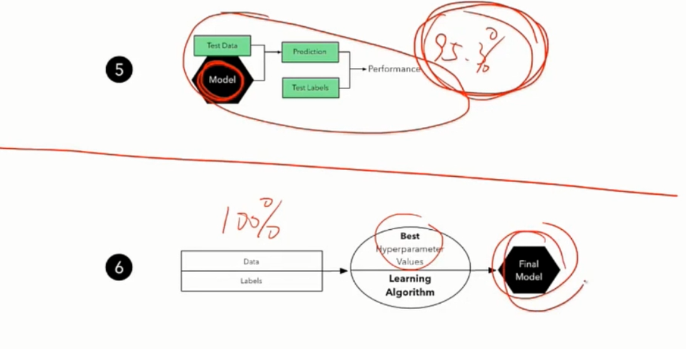

# 机器学习与机器学习系列课程（四）

量化需要学习：

强化学习+code

http://stockcharts.com/school/doku.php?id=chart_school:technical_indicators

可以把链接里的每一个技术指标都用函数实现。

## From OLS(线性回归) to kernel machines and beyond？

​	

OLS(最小二乘)，Ridge，lasso，Kernels，Cross-validation，Hands on: sklearn。


机器学习的例子

​	自动驾驶，图像识别，识别垃圾邮件

机器学习的分类

​	有监督学习，非监督学习，强化学习（背后的算法：MDP：马尔科夫决策过程）

监督学习：回归问题和分类问题

无监督学习：聚类和降维

常见问题：先降维，后分类。

Sklearn根据数据来划分算法


建议：对于降维来说，如果数据小于30K，建议先用PCA降到50维，然后用TSNE到2维


The simplest sklearn workflow

```python
train_x,train_y,test_x,test_y = getData()

model = somemodel()  # svm(),lasso(),OLS()
model.fit(train_x,train_y) #学习或计算出模型参数的最优组合
predictions = model.predict(test_x)

score = score__function(test_y,predictions)#对模型进行评分
# 如果评分好，回测也不一定好，机器学习大部分时间是告诉我们什么是不能用的，而不是什么是能用的
```

**一个常见的鲜花数据集（IRIS-Setosa）**


人造数据也可以，甚至可以利用skilearn造数据

from sklearn .datasets import make_...


## 从传统线性回归模型到高级线性model

Regression shrinkage and selection via the lasso

#### 岭回归：


**岭回归的几何解释**：

一个圆圈，

本质就是δ的选择就是在两个凸函数之间取最优解


但是岭回归不具备特征选择的功能，即500维的特征选出20维有效的特征

而lasso可以去掉一些不重要的特征，即θ等于0

#### lasso

从几何上也可以看出来，一般交点都是在坐标轴上（总有一个θ为0）


3、对输入数据做非线性处理，这样就可以做非线性回归。


#### 过拟合和欠拟合


当δ比较大的时候，θ就会相应减小，此时训练出来的模型，对于输入数据的变化敏感度就会变小，造成欠拟合的情况。


#### kernel regression and RBF(radial basis functions)

跟傅里叶变换很类似


1、核函数的数目？先做一个K-means回归聚类到20维(RBF需要提前指定)

2、核函数分布的位置：

3、核函数不一定要是高斯核


上图展示的是我们需要找一个合适超参数λ

#### 超参数的选择

​	the regularization coefficient,

​	the width of the kernel

​	the polynomial order

比如想训练找到超参数δ的优解，可以将数据分成训练集，测试集，验证集




**一般最后汇报的是Final model （用100%的数据训练出来的模型），正确率是第5步时测试得出来的正确率**

注：不同模型中一般都有经验性的超参数，在sklearn中都有默认的设置


当我们的超参数数目较多时，比如两个，可以画上图的热力图，方块越白，代表性能越好，如果超过两个参数，那么只能是画参数两两的超参数的热力图。


#### 如何设置输入数据

http://stockcharts.com/school/doku.php?id=chart_school:technical_indicators

可以把链接里的每一个特征都用函数实现。


