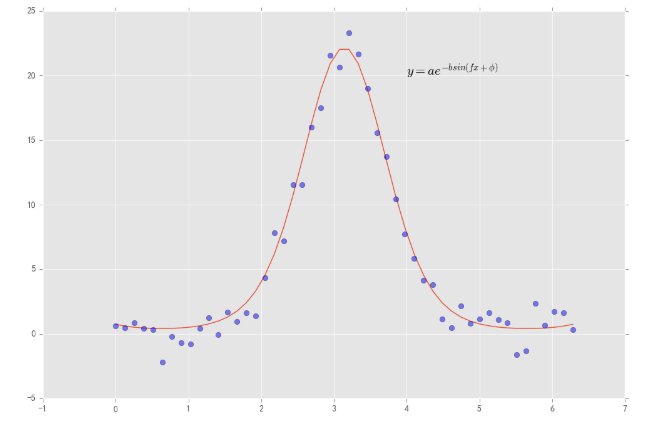

## Python基础知识

课程链接：https://www.windquant.com/qntcloud/college

### 目录

* 本小节自己学到的小技巧

   

  **numpy 中可以利用numpy.linalg进行多项式拟合**

  **scipy中可以利用from scipy.optimize import leastsq进行最小二乘拟合**

  **sicpy中利用 import scipy.optimize as sco  求解约束最优化问题**


* python面向对象的用法
* numpy的常用功能
* pandas的常用功能
* Scipy的常用功能


### Python用法


#### 面向对象 class

```python
class charater:
    '''创建游戏人物'''
    def __init__(self, name, gender, age, ability):
        self.name = name
        self.gender = gender
        self.age = age
        self.ability = ability
        
    def fight_grass(self):
        self.ability = self.ability - 200
        print(self.name ,'参加了一次野外战斗,消耗战斗力200')
        
    def self_trainng(self):
        self.ability = self.ability + 100
        print(self.name ,'参加了一次自我修炼，增长战斗力100')
        
    def mass_fight(self):
        self.ability = self.ability - 500
        print('%s参加了一次多人PK,消耗战斗力500' %self.name)
        
    def show_info(self):
        print('%s,%s岁,%s,%s战斗力' %(self.name,self.age,self.gender,self.ability))
        
 

#定义好上面的类之后 我们就可以开始游戏了  我们先创建3个游戏人物  rogers stark 和 natasha
rogers = charater('史蒂夫 罗杰斯','男',18,1000)
stark = charater('托尼 斯塔克','男',20,1800)
natasha = charater('娜塔莎 罗曼诺夫','女',19,2500)


# 创建人物之后  每个人物可以进行不同的游戏环节 例如他们三个人 进行不同的游戏环节
rogers.mass_fight()  
stark.self_trainng() 
natasha.fight_grass()        
```


### Numpy

#### numpy的常用函数

`多元线性拟合：`

```
from numpy import polyfit,poly1d
```

`矩阵运算：

```
 import numpy.linalg as la
```


####<CENTER>numpy.linalg函数

| 函数            |                            说明                            |
| --------------- | :--------------------------------------------------------: |
| diag            | 以一维数组的形式返回方阵的对角线元素或将一维数组转化为方阵 |
| dot、trace、det |             矩阵乘法、矩阵的迹运算、矩阵行列式             |
| eig、inv、pinv  | 方阵的特征值和特征向量、方阵的逆、矩阵的Moore-Penrose伪逆  |
| qr、svd         |                  矩阵的QR分解、奇异值分解                  |
| solve           |           解线性方程组$X\beta=y$，其中$X$为方阵            |
| lstsq           |                 计算$X\beta=y$的最小二乘解                 |


#### 多项式曲线拟合

```PYTHON
import numpy as np
# numpy下的子模块linalg是一个线性代数运算库，关于矩阵运算主要使用该库来完成
import numpy.linalg as la
import matplotlib.pyplot as plt   # 导入作图库  为了更好展示曲线拟合的结果
plt.style.use('ggplot')


x = np.linspace(-10,10,100)
y = 2*x + 1 + np.random.randn(100)*2
fig = plt.subplots(figsize=(10,8))
plt.plot(x, y, 'rx')
plt.show()
```


```PYTHON
from numpy import polyfit,poly1d

coef_fit = polyfit(x, y, 1)  #进行线性拟合 1代表的是多项式拟合的多项式的阶数  这里指的是线性拟合
coef_fit    #查看拟合的系数

fig = plt.subplots(figsize=(14,8))
plt.plot(x, y, 'rx',label='真实散点')
plt.plot(x, coef_fit[0] * x + coef_fit[1], 'k-',label='拟合直线')
plt.legend(loc='best')
plt.show()
```


###Pandas

#### pandas的series经常被忽略

    s_array = np.random.randn(5)
    s = pd.Series(s_array, index = ['a','b','c','d','e'])
#### pandas的dataframe
数据 + columns + index

    df = pd.DataFrame(list2.Data,columns=list2.Times,index=list2.Fields)
`DataFrame行列截取：` 截取df的前4行的close和low列:

```python
df.ix[:4,['CLOSE','LOW']]
```


```PYTHON
from WindPy import *
w.start()

# 先取一个金融时间序列，以DataFrame的形式

error_code,df4 = w.wsd("000001.SZ", "open,close,pct_chg", "2018-04-20", "2018-04-30", "",usedf=True)
df4['standard'] = df4.PCT_CHG.apply(lambda x: 'up' if x > 0 else 'down')
df4['expression'] = df4.CLOSE.apply(lambda x: 'good' if x > 11 else 'bad')
df4
```


```PYTHON
#对分组进行迭代
for name,group in df4.groupby('standard'):
    print(name)
    print(group)
```


DataFrame拼接：`  pd.concat, pd.merge, .join

```python
pd.concat([data_df,data_df1],axis=0)                     # 按行拼接，axis=1按列拼接    
pd.merge(data_df,data_df1,on='LASTRADEDAY_S')            # 一般是按列拼接    
data_df.join(data_df1,lsuffix='_left',rsuffix='_right')  # 一般是按列拼接，但是会保留重复列
```

 `DataFrame分组与透视：`  groupby 和 unstack

```PYTHON
df4.groupby(['standard','expression'])[['CLOSE']].mean() # 在['CLOSE']前后再多加一组[]即可
```

 

`DataFrame多级索引：`

```python
 error_code,df_wss = w.wss("000001.SZ,000088.SZ,002626.SZ,600021.SH,600036.SH", "open,high,low,volume,amt,pct_chg", "tradeDate=2018-05-29;priceAdj=1;cycle=1",usedf=True)   
 columns = pd.MultiIndex.from_arrays([['行情','行情','行情','量','量','幅度'],
                                 ['OPEN','HIGH','LOW','VOLUME','AMT','PCT_CHG']],names=['s1','s2'])
 hier_df = pd.DataFrame(df_wss.values, columns=columns,index=df_wss.index)
```

### Scipy

**Scipy包括统计，优化，整合，线性代数，傅里叶变换，信号和图像处理，常微分方程求解器等等模块。**


<center>SciPy子模块构成

| 子模块            | 功能                       | 子模块         | 功能                 |
| ----------------- | -------------------------- | -------------- | -------------------- |
| **`cluster`**     | **`聚类算法`**             | **`optimize`** | **`优化和求根`**     |
| constants         | 物理数学常数               | **`signal`**   | **`信号处理`**       |
| fftpack           | 快速傅里叶变换             | sparse         | 稀疏矩阵             |
| **`integrate`**   | **`积分和常微分方程求解`** | spatial        | 空间数据结构和算法   |
| **`interpolate`** | **`插值处理`**             | special        | 特殊方程             |
| io                | 输入输出                   | **`stats`**    | **`统计分布和函数`** |
| linalg            | 线性代数                   | weave          | C/C++积分            |
| odr               | 正交距离回归               |                |                      |

利用scipy模块下的integrate子模块可以进行积分求解，和微分方程的求解。


#### 4.1 、数值积分—quad
quad函数求积分，会输出积分值，和最大误差。注意quad函数**`一次只能`**求解**`一重`**积分。

$$
\large \int_{a}^{b}dF(x) = ?
$$

$$
\large \int_{a}^{b}dF(x) = lim\sum_{i=1}^{n}f(x_i) \Delta x_i
$$


```python
import numpy as np
import pandas as pd
np.set_printoptions(precision=4, suppress=True) #设置浮点数的显示格式 
import matplotlib.pyplot as plt
plt.style.use('ggplot')
# 这是一个作图的模块 因为后续有些结果要用图形显示 所以这里导入了该模块
#积分求解
from scipy.integrate import trapz #梯形法求积分
from scipy.integrate import quad 
interval = [0., np.inf] #上下限范围 

def g(x):
    return np.exp(-x ** 1/2)
value, max_err = quad(g, *interval)


x = np.linspace(0, 10, 50) #待计算的x的取值范围
plt.figure(figsize=(14,6))
plt.plot(x, g(x), 'k-')
plt.fill_between(x, g(x))  #填充画图区域，更加美观
plt.annotate(r"$\int_0^{\infty}e^{-x^{1/2}}dx = $" + "{}".format(value), 
             (4, 0.6), fontsize=16)
plt.show()
print("upper bound on error: {:.1e}".format(max_err))
```


#### 4.2 、常微分方程求解—odeint

$$
\large \frac{dy}{dx}=sin(x)
$$

```python
from scipy.integrate import odeint

def fx(y,x):
    return np.sin(x)

x = np.linspace(0, 2*np.pi, 100)
result = odeint(fx, 0, x)
print(result[:10])


plt.figure(figsize=(14,6))
plt.plot(x, result, "rx", label=r"$\int_{0}^{x}sin(t) dt $")
plt.plot(x, -np.cos(x) + np.cos(0), color='purple',label=r"$cos(0) - cos(x)$")
plt.plot(x, fx(0, x), "g-", label=r"$sin(x)$")
plt.legend(loc="upper right")
plt.xlabel("x")
plt.show()
```


#### 4.3、最优化求解——optimize

##### 4.3.1 曲线拟合
曲线拟合实际上是一个最优化某目标函数的问题

```python
from scipy.stats import norm   #norm用来产生正态随机数 

def function(x, a , b, f, phi):
    """函数有四个参数"""
    result = a * np.exp(-b * np.sin(f * x + phi))
    return result

#人为构造数据集，并画图展示 ，真实函数如下图红线所示，蓝色点表示的是样本点
plt.figure(figsize=(12,8))
x = np.linspace(0, 2 * np.pi, 50)
actual_parameters = [3, 2, 1.25, np.pi / 4]
y = function(x, *actual_parameters)
y_noisy = y +  norm.rvs(size=len(x))
plt.plot(x,y)
plt.plot(x, y_noisy, 'bo',alpha=0.5)
plt.xlim(-1,7)
plt.annotate(r'$y = ae^{-bsin(fx+\phi)}$',(4,20),fontsize=15)
plt.show()
```



假设我们已经知道了函数的形式为 $y = ae^{-bsin(fx+\phi)}$，只需要估计函数中的参数。基于样本数据，利用最小二乘的方法来估计函数中的参数.

```python
from scipy.optimize import leastsq
def f_err(p, y, x):
    '''定义误差函数'''
    return y - function(x, *p)

#利用最小二乘法求解，f_err为误差函数，[1,1,1,1]表示初始值
coef, is_success = leastsq(f_err, [1, 1, 1, 1], args=(y_noisy, x))

#coef为参数估计  is_success的值为1~4之间时表示成功找到了最小二乘解
#coef, is_success
plt.figure(figsize=(12,8))
plt.plot(x,y, label='真实函数')
plt.plot(x, y_noisy, 'bo',alpha=0.5,label='样本散点')
plt.plot(x, function(x, *coef), 'k--',label='拟合曲线')
plt.xlim(-1,7)
plt.legend(loc='best')
plt.show()
```


##### 4.3.2 资产组合的有效边界求解 

例如我们有四种资产，利用这四种资产构建投资组合，根据马克维茨的现代投资组合理论可以求解有效边界。求解有效边界的过程实际上就是一个求解最优化问题的过程。

————在组合目标收益率情况下，最小化组合方差，求解有效边界。具体而言就是在不同的期望回报率约束下，求解下面的数学优化问题


$$
 Min 　投资组合方差=\sum_{i=1}^{n}\sum_{j=1}^{n}w_iw_j\sigma_{ij}
$$

$$
s.t. \sum_{i=1}^{n}w_iE(r_i) = 期望回报率, \sum_{i=1}^{n}w_i = 1
$$

```python
import scipy.optimize as sco #求解约束最优化问题
# 资产组合的有效边界求解
# 假设已知四种资产收益，及其协方差，
r = np.array([-0.15, 0.12, 0.31, 0.04])
cov_mat = np.array([[0.1948,0.1247,0.0868,0.1127],
                   [0.1247,0.2063,0.1095,0.1176],
                   [0.0868,0.1095,0.2983,0.1015],
                   [0.1127,0.1176,0.1015,0.1449]])
k = len(r)  

# 这里随机构造4000个投资组合
port_r, port_var = [], []
for p in range(4000):
    weights = np.random.random(k) # 生成0~4的随机数
    weights /= np.sum(weights)    # 计算权重，由此可知权重的取值范围为（0~1）
    port_r.append(np.sum(r*weights))  # 组合的期望回报率
    port_var.append(np.sqrt((weights.T).dot(cov_mat).dot(weights))) #投资组合的方差，这里也可以代表波动率 
port_r, port_var = np.array(port_r), np.array(port_var)

def statistics(weights):
    '''计算方法'''
    weights = np.array(weights)
    port_returns = np.sum(r*weights) #组合的期望回报率
    port_variance = np.sqrt((weights.T).dot(cov_mat).dot(weights))#投资组合的方差

    return np.array([port_returns, port_variance, port_returns/port_variance])

def min_variance(weights):
    '''返回的是投资组合的方差'''
    return statistics(weights)[1]


#在不同目标收益率水平（target_returns）循环时，最小化的一个约束条件会变化。
target_returns = np.linspace(0.0,0.31,70) # 给定一个约束条件
target_variance = []
for tar in target_returns:
    bnds = tuple((0,1) for x in range(k))    #，由假设可知，k=4,输出结果是((0, 1), (0, 1), (0, 1), (0, 1)),代表参数的取值范围
    #这里使用了lambda函数来表示优化问题的约束条件
    cons = ({'type':'eq','fun':lambda x:statistics(x)[0]-tar},{'type':'eq','fun':lambda x:np.sum(x)-1}) 
    res = sco.minimize(min_variance, k*[1./k],method = 'SLSQP', bounds = bnds, constraints = cons)
    target_variance.append(res['fun'])
target_variance = np.array(target_variance)

# 可视化有效边界，可看到随机构造的投资组合都越不过有效边界
risk_free = 0.1
plt.figure(figsize = (14,8))
plt.scatter(port_var, port_r, c=(port_r-risk_free)/port_var,  marker = 'o',label='随机投资组合')
plt.plot(target_variance, target_returns, c = 'red', linewidth=2.3, label='有效边界' )
plt.grid(True)
plt.xlabel('波动率')
plt.ylabel('期望收益率')
plt.legend(loc='best')
plt.colorbar(label = '夏普比率')
plt.show() 
```


#### 4.4、概率统计
##### 4.4.1 描述性统计
样本均值，中位数，最大值，标准差，众数，2阶矩，偏度，峰度
##### 4.4.2 连续概率分布
scipy的统计模块下，包含了很多种连续概率分布函数。对于这些连续概率分布函数，通常会用四种操作：

分布简称.cdf——累计分布函数
分布简称.pdf——概率密度函数
分布简称.rvs——指定参数的随机变量
分布简称.fit——对于某个样本拟合该分布，对各个参数的MLE值
##### 4.4.3其他分布
```python
from scipy.stats import lognorm, chi2, f, t  #导入对数正态分布 卡方分布 F分布 t分布
```

##### 4.4.4离散概率分布   

对于离散概率分布函数，通常会用三种操作：
+ 分布简称.cdf——累计分布函数
+ 分布简称.pmf——概率质量函数
+ 分布简称.rvs——指定参数的随机变量

##### 4.4.5 假设检验

###### 4.4.5.1正态性检验
检验一组样本是否可认为服从正态分布。

KS检验，从峰度和偏度出发，进行的检验。该检验不光能检验某数据集服从正态，也可以检验该数据集是否服从其他的分布。

用法：kstest(待检验数据集, 何种类型分布的检验, args=(), N=20, alternative=’two_sided’(设置双尾，单尾检验等), mode=’approx’, **kwds)

具体的可以参考：https://docs.scipy.org/doc/scipy-0.7.x/reference/generated/scipy.stats.kstest.html

经过KS检验发现p值很小，则拒绝原假设，即有充足理由认为该样本不是来自于正态总体的

Shapiro检验，专门用来做正态性检验的模块。需注意的是，在样本数很大的情况下，该检验不适合做正态性检验，检验结果可能不准确。

具体可以参考：https://docs.scipy.org/doc/scipy/reference/generated/scipy.stats.shapiro.html

###### 4.4.5.2 两独立样本均值检验

检验两个独立的样本对应总体的均值是否存在显著的差异


#### 4.5、聚类分析—cluster

import scipy.cluster.hierarchy as sch


#### 4.6、插值处理——interpolate

##### 4.6.1、 一维插值
```python
ip_nearest = interp1d(x,y, kind='nearest')  #最近邻插值
ip_zero = interp1d(x,y, kind='zero')        #0阶插值
ip_linear = interp1d(x,y, kind='linear')    #线性插值
ip2 = interp1d(x,y, kind='quadratic')       #二次插值
ip3 = interp1d(x,y, kind='cubic')           #三次插值
```


##### 4.6.2、 径向基(RBF)插值

有些插值方法基于径向基函数，径向基函数的含义是点x处的函数值只依赖于x与某点c的距离。
常用的径向基函数(RBF)有Gaussian函数，Multiquadric函数和Inverse Multiquadric函数。


#### 4.7、信号处理
##### 4.7.1 序列线性趋势提取
例如对于某一时间序列x_series，希望提取其中的趋势项，并查看趋势项的形态

```python
from scipy import signal
after_trend = signal.detrend(x_series,type='linear')   # 对序列x_series做剔除趋势项处理  type-linear指定趋势为线性的，也可设置为constant
```


##### 4.7.2 傅里叶变换
傅里叶分析实际上是在频域考虑时域的问题，例如这里的将剔除某曲线(序列)中一些特定的频率成分，提取剩余部分成为滤波，再将频域中的滤波转化为时域当中显示的过程。

关于傅里叶分析可以参考：http://blog.jobbole.com/70549/

那么对于投资领域中股票的K线图，实际上是时域下的一条曲线，通过傅里叶分析将其转化到频域，再做频域下的处理，之后返回到时域上，可能会有出乎意料的效果。因为很多在时域上不好处理的操作，在频域上很容易实现。

```python
from scipy import fftpack
```

