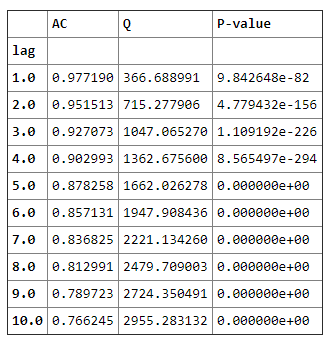
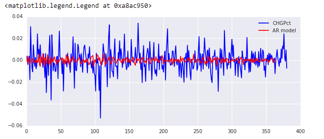
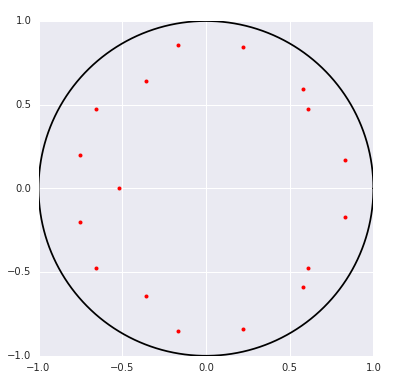
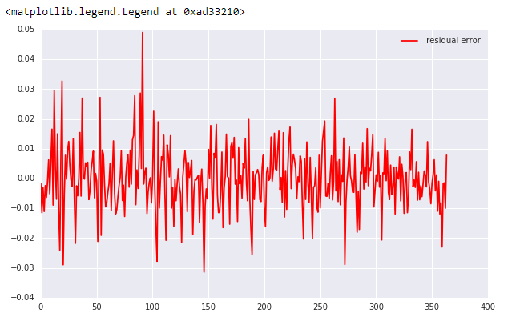
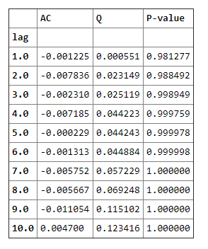
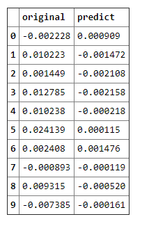
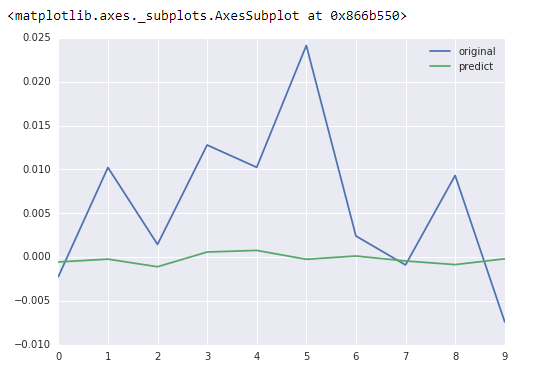

# 01.时间序列分析

时间序列系列

时间序列分析的主要目的是根据已有的历史数据对未来进行预测 。

对某一个或者一组变量x(t)进行观察测量，将在一系列时刻t1,t2,⋯,tn所得到的离散数字组成的序列集合，称之为时间序列。 


一些特征:
 **趋势**：是时间序列在长时期内呈现出来的持续向上或持续向下的变动。

**季节变动**：是时间序列在一年内重复出现的周期性波动。它是诸如气候条件、生产条件、节假日或人们的风俗习惯等各种因素影响的结果。

**循环波动**：是时间序列呈现出得非固定长度的周期性变动。循环波动的周期可能会持续一段时间，但与趋势不同，它不是朝着单一方向的持续变动，而是涨落相同的交替波动。

**不规则波动**：是时间序列中除去趋势、季节变动和周期波动之后的随机波动。不规则波动通常总是夹杂在时间序列中，致使时间序列产生一种波浪形或震荡式的变动。只含有随机波动的序列也称为**平稳序列**。


对一个**平稳时间序列**的样本{$r_t$}，$1\le t\le T$,则间隔为$l$的样本自相关系数的估计为:

$$
\hat \rho_l = \frac{\sum{t=l+1}^{T}(r_t- \bar r)(r{t-l}-\bar r)}{ \sum_{t=1}^{T}(r_t- \bar r)^{2}}, 0 \leqslant l \leqslant T-1
$$
则函数$ \large \hat \rho_1,\hat \rho_2 ,\hat \rho_3...$称为$r_t$的**样本自相关函数(ACF)**

当自相关函数中**所有的值**都为0时，我们认为该序列是完全不相关的；因此，我们经常需要检验多个自相关系数是否为0。


#### **混成检验**


原假设 


$$
H0: \rho_1 = ... = \rho_m=0
$$
备择假设


$$
H1: \exists i \in \{1,...,m\}, \rho_i \ne 0 
$$
混成检验统计量：
$$
\large Q(m) = T(T+2) \sum_{l=1}^{m} \frac{\hat{\rho_l}^{2}}{T-l}
$$

$Q(m)$渐进服从自由度为$m$的$ \chi^2 $分布

决策规则：
$$
\large Q(m) > \chi_\alpha^{2} ,拒绝H_0
$$
即,$Q(m)$的值大于自由度为$m$的卡方分布$100(1-\alpha)$分位点时，我们拒绝$H_0$。

即,$Q(m)$的值大于自由度为$m$的卡方分布$100(1-\alpha)$分位点时，我们拒绝$H_0$。

**大部分软件会给出$Q(m)$的p-value，则当p-value小于等于显著性水平 $\alpha$时拒绝H0。**

```python
from scipy import  stats
import statsmodels.api as sm  # 统计相关的库

data = IndexData['closeIndex'] # 上证指数
m = 10 # 我们检验10个自相关系数

acf,q,p = sm.tsa.acf(data,nlags=m,qstat=True)  ## 计算自相关系数 及p-value
out = np.c_[range(1,11), acf[1:], q, p]
output=pd.DataFrame(out, columns=['lag', "AC", "Q", "P-value"])
output = output.set_index('lag')
output
```




我们取显著性水平为0.05，可以看出，所有的p-value都小于0.05；则我们拒绝原假设$H_0$。

因此，我们认为该序列，即上证指数序列，是**序列相关**的。


#### 线性时间序列

时间序列{$r_t$}，如果能写成：
$$
\large r_t = \mu + \sum_{i=0}^{\infty}\psi_ia_{t-i} \\ \large \mu为r_t 的均值， \psi_0=1,\{a_t\}为白噪声序列
$$
则我们称{$r_t$} 为线性序列。其中$a_t$称为在$t$时刻的**新息(innovation)**或**扰动(shock)**

则我们称{$r_t$} 为线性序列。其中$a_t$称为在$t$时刻的**新息(innovation)**或**扰动(shock)**

很多时间序列具有线性性，即是线性时间序列，相应的有很多线性时间序列模型，例如接下来要介绍的**AR、MA、ARMA**，都是线性模型，但**并不是所有的金融时间序列都是线性的**

对于**弱平稳序列**，我们利用白噪声的性质很容易得到$r_t$的均值和方差：
$$
\large E(r_t) = \mu , Var(r_t) = \sigma_a^2 \sum_{i=0}^{\infty} \psi_i^{2} \\ \large \sigma_a^2为a_t的方差。
$$
因为$Var(r_t)$一定小于正无穷，因此$ \{\psi_i^2\}$必须是**收敛序列**，因此满足 $$ i \to \infty   时， \psi_i^2 \to 0$$

即，**随着$i$的增大，远处的扰动$a_{t-i}$对$r_t$的影响会逐渐消失。**


#### **自回归(AR)模型**

假设在$t-1$时刻的数据$r_{t-1}$，在预测$t$时刻$r_t$时可能是有用的。
$$
\large r_t = \phi_0 + \phi_1r_{t-1} + a_t
$$
其中{$a_t$}是**白噪声序列**，这个模型与简单线性回归模型有相同的形式，这个模型也叫做一阶自回归\(AR\)模型，**简称AR\(1\)模型**

从AR\(1\)很容易推广到AR\(p\)模型：
$$
\large r_t = \phi_0 + \phi_1r_{t-1} + \cdots + \phi_pr_{t-p}+ a_t \qquad
$$
我们先假定序列是**弱平稳**的，则有;
$$
\large E(r_t) = \mu \qquad \large Var(r_t) = \gamma_0 \qquad \large Cov(r_t,r_{t-j})=\gamma_j , 其中\mu,\gamma_0 是常数
$$


##### **AR(p)模型的特征根及平稳性检验**

因为$a_t$是白噪声序列，因此有：
$$
\large E(a_t) = 0, Var(a_t) = \sigma_a^2
$$


所以有：
$$
\large E(r_t) = \phi_0 + \phi_1E(r_{t-1}) + \phi_2E(r_{t-2}) + \cdots + \phi_pE(r_{t-p})
$$


根据平稳性的性质，又有$E(r_t)=E(r_{t-1})=...=\mu$，从而：
$$
\large \mu = \phi_0 + \phi_1\mu + \phi_2\mu+ \cdots +\phi_p\mu\\ \large E(r_t)=\mu=\frac{\phi_0}{1-\phi_1 - \phi_2 - \cdots -\phi_p} \qquad
$$
假定分母不为0， 我们将下面的方程称为**特征方程:** 
$$
\large 1 - \phi_1x - \phi_2x^2 - \cdots -\phi_px^p = 0
$$
该方程**所有解的倒数称为该模型的特征根**，如果所有的**特征根的模都小于1**，则该AR\(p\)序列是平稳的。

```python
#检验上证指数日收益率序列的平稳性
temp = np.array(data2) # 载入收益率序列
model = sm.tsa.AR(temp)  
results_AR = model.fit()  
plt.figure(figsize=(10,4))
plt.plot(temp,'b',label='CHGPct')
plt.plot(results_AR.fittedvalues, 'r',label='AR model')
plt.legend()
```




```python
pi,sin,cos = np.pi,np.sin,np.cos
r1 = 1
theta = np.linspace(0,2*pi,360)
x1 = r1*cos(theta)
y1 = r1*sin(theta)
plt.figure(figsize=(6,6))
plt.plot(x1,y1,'k')  # 画单位圆
roots = 1/results_AR.roots  # 注意，这里results_AR.roots 是计算的特征方程的解，特征根应该取倒数
for i in range(len(roots)):
    plt.plot(roots[i].real,roots[i].imag,'.r',markersize=8)  #画特征根
plt.show()
```



可以看出，所有特征根都在单位圆内，则序列为平稳的！


##### **AR(p)模型的定阶**

一般有两种方法来决定p：

第一种：利用**偏相关函数(Partial Auto Correlation Function,PACF)**

第二种：利用**信息准则函数**


**AR\(p\)序列的样本偏相关函数是p步截尾的。**

所谓截尾，就是快速收敛应该是快速的降到几乎为0或者在置信区间以内。


**信息准则— AIC、BIC、HQ**

**AIC=-2ln(L)+2k 中文名字：赤池信息量 akaike information criterion**

**BIC=-2ln(L)+ln(n)\*k 中文名字：贝叶斯信息量 bayesian information criterion**

**HQ=-2ln(L)+ln(ln(n))\*k hannan-quinn criterion**

```python
aicList = []
bicList = []
hqicList = []
for i in range(1,11):  #从1阶开始算
    order = (i,0)  # 这里使用了ARMA模型，order 代表了模型的(p,q)值，我们令q始终为0，就只考虑了AR情况。
    tempModel = sm.tsa.ARMA(temp,order).fit()
    aicList.append(tempModel.aic)
    bicList.append(tempModel.bic)
    hqicList.append(tempModel.hqic)
```


##### AR**模型的检验**

如果模型是充分的，其残差序列应该是**白噪声**，根据我们第一章里介绍的混成检验，可以用来检验残差与白噪声的接近程度。

```PYTHON
delta = results_AR.fittedvalues  - temp[17:]  # 残差
plt.figure(figsize=(10,6))
#plt.plot(temp[17:],label='original value')
#plt.plot(results_AR.fittedvalues,label='fitted value')
plt.plot(delta,'r',label=' residual error')
plt.legend(loc=0)
```



```PYTHON
acf,q,p = sm.tsa.acf(delta,nlags=10,qstat=True)  ## 计算自相关系数 及p-value
out = np.c_[range(1,11), acf[1:], q, p]
output=pd.DataFrame(out, columns=['lag', "AC", "Q", "P-value"])
output = output.set_index('lag')
output
```



观察p-value可知，该序列可以认为没有相关性，近似得可以认为残差序列接近白噪声。


##### **AR模型拟合优度及预测**


**拟合优度**

我们使用下面的统计量来衡量拟合优度：
$$
\large R^2 = 1 - \frac{残差的平方和}{总的平方和}
$$


但是，对于一个给定的数据集，$R^2$是用参数个数的非降函数，为了克服该缺点，推荐使用调整后的$R^2$:
$$ $$
$$
\large Adj R^2 = 1- \frac{残差的平方}{r_t的方差}
$$
它的值在0-1之间，越接近1，拟合效果越好。

下面我们计算之前对上证指数日收益率的AR模型的拟合优度。

```python
score = 1 - delta.var()/temp[17:].var()
```

可以看出，模型的拟合程度并不好，当然，这并不重要，也许是这个序列并不适合用AR模型拟合。


**预测**

我们首先得把原来的样本分为训练集和测试集，再来看预测效果，还是以之前的数据为例：

```python
train = temp[:-10]
test = temp[-10:]
output = sm.tsa.AR(train).fit()  
predicts = output.predict(355, 364, dynamic=True)
print len(predicts)
comp = pd.DataFrame()
comp['original'] = temp[-10:]
comp['predict'] = predicts
comp
```




该模型的预测结果是很差的，那么我们需要通过其他模型获得更好的结果。


#### 

#### 

#### **滑动平均(MA)模型**


这里我们直接给出MA\(q\)模型的形式：
$$
 \large r_t = c_0 + a_t - \theta_1a_{t-1} - \cdots - \theta_qa_{t-q}
$$


$c_0$为一个常数项。这里的$a_t$,是AR模型$t$时刻的**扰动**或者说**新息**，则可以发现，该模型，使用了**过去q个时期的随机干扰或预测误差来线性表达当前的预测值**。


##### **MA模型的性质**


**MA模型总是弱平稳的**，因为他们是白噪声序列（残差序列）的有限线性组合。因此，根据弱平稳的性质可以得出两个结论：
$$
\large E(r_t) = c_0  \\ \large Var(r_t) = (1+ \theta_1^2 + \theta_2^2 + \cdots +\theta_q^2)\sigma_a^2
$$
对q阶的MA模型，其**自相关函数ACF**总是**q步截尾**的。 因此MA(q)序列只与其前q个延迟值线性相关，从而它是一个“**有限记忆**”的模型。这一点可以用来确定模型的阶次


##### **MA建模和预测**

由于sm.tsa中没有单独的MA模块，我们利用ARMA模块，只要将其中AR的阶p设为0即可。

函数sm.tsa.ARMA中的输入参数中的order\(p,q\)，代表了AR和MA的阶次。 模型阶次增高，计算量急剧增长，因此这里就建立10阶的模型作为示例，


```PYTHON
order = (0,10)
train = data[:-10]
test = data[-10:]  #我们用最后10个数据作为out-sample的样本，用来对比预测值。
tempModel = sm.tsa.ARMA(train,order).fit()

delta = tempModel.fittedvalues - train  # 计算残差
score = 1 - delta.var()/train.var()    # 计算拟合优度得分

#用建立的模型进行预测最后10个数据
predicts = tempModel.predict(371, 380, dynamic=True)
print len(predicts)
comp = pd.DataFrame()
comp['original'] = test
comp['predict'] = predicts
comp.plot()
```



可以看出，建立的模型效果很差，预测值明显小了1到2个数量级！就算只看涨跌方向，正确率也不足50%。该模型不适用于原数据。

#### 

#### 

#### 自回归滑动平均(ARMA)模型

在有些应用中，我们需要高阶的AR或MA模型才能充分地描述数据的动态结构，这样问题会变得很繁琐。为了克服这个困难，提出了自回归滑动平均\(ARMA\)模型。

基本思想是把AR和MA模型结合在一起，使所使用的参数个数保持很小。

模型的形式为：
$$
\large r_t = \phi_0 + \sum_{i=1}^p\phi_ir_{t-i} + a_t + \sum_{i=1}^q\theta_ia_{t-i}
$$


其中，$a_t$为白噪声序列，$p$和$q$都是非负整数。**AR和MA模型都是ARMA\(p,q\)的特殊形式**。

利用**向后推移算子$B$**，上述模型可写成: 
$$
\large (1-\phi_1B - \cdots -\phi_pB^p)r_t = \phi_0 + (1-\theta_1B-\cdots - \theta_qB^q)a_t
$$
（后移算子$B$，即**上一时刻**）


ARMA的建模与预测步骤与AR，MA建模预测相似，这里就不再实现。


#### 

#### **ARIMA模型**

**到目前为止，我们研究的序列都集中在平稳序列**。即ARMA模型研究的对象为平稳序列。如果序列是非平稳的，就可以考虑使用ARIMA模型。

ARIMA比ARMA仅多了个"I"，代表着其比ARMA多一层内涵：也就是**差分**

**一个非平稳序列经过d次差分后，可以转化为平稳时间序列**。d具体的取值，我们得分被对差分1次后的序列进行平稳性检验，若果是非平稳的，则继续差分。直到d次后检验为平稳序列。


##### ARIMA基本步骤

1. 获取被观测系统时间序列数据；

2. 对数据绘图，观测是否为平稳时间序列；对于非平稳时间序列要先进行**d阶差分运算**，化为平稳时间序列；

3. 经过第二步处理，已经得到平稳时间序列。要对平稳时间序列分别求得其**自相关系数ACF** 和**偏自相关系数PACF** ，通过对自相关图和偏自相关图的分析，得到最佳的**阶层 p** 和**阶数 q**, 如果看图定阶数过高。建模计算量太大。我们可以看看AIC准则  ；

   \# 如果自相关是拖尾，偏相关截尾，则用 AR 算法
   \# 如果自相关截尾，偏相关拖尾，则用 MA 算法

   \# 如果自相关和偏相关都是拖尾，则用 ARMA 算法， ARIMA 是 ARMA 算法的扩展版，用法类似.

   (所谓截尾，就是快速收敛应该是快速的降到几乎为0或者在置信区间以内)

4. 由以上得到的d、q、p ，得到ARIMA模型。然后开始对得到的模型进行模型检验。


##### ADF检验

ADF是一种常用的单位根检验方法，它的**原假设为序列具有单位根，即非平稳**，对于一个平稳的时序数据，就需要在给定的置信水平上显著，拒绝原假设。

```python
t = sm.tsa.stattools.adfuller(data)  # ADF检验
print "p-value:   ",t[1]
```

如果p-value小于显著性水平，拒绝原假设，因此序列是平稳的 。


#### 自回归条件异方差模型(ARCH)


##### **波动率的特征**

对于金融时间序列，波动率往往具有以下特征：

（1）存在**波动率聚集**现象。 即波动率在一段时间上高，一段时间上低。

（2）波动率以连续时间变化，很少发生跳跃

（3）波动率不会发散到无穷，波动率往往是**平稳**的

（4）波动率对价格大幅上升和大幅下降的反应是不同的，这个现象为**杠杆效应**


波动率的ARCH模型效应，也就是**条件异方差序列的序列相关性** 。


步骤（1）：通过检验数据的序列相关性建立一个均值方程，如有必要，对收益率序列建立一个计量经济模型（如ARMA）来消除任何线形依赖。

可以检验序列平稳性，是否需要差分 

步骤（2）：对均值方程的残差进行ARCH效应检验

		计算均值方程残差：at =  rt - ut,然后对{at^2}序列进行混成检验： 原假设H0:序列没有相关性，备择假设H1：序列具有相关性 		

步骤（3）：如果具有ARCH效应，则建立波动率模型

步骤（4）：检验拟合的模型，如有必要则进行改进


#  02.**Q   Quant**

*q quant做的是“如何不承担风险”。* *p quant做的是“承担哪些风险”。*

volatility trading做的就是对冲掉股票价格风险（q measure），预测未来波动率走势（p measure）  


Q重模型而轻数据，P则重数据而轻模型。当然两者也都要即有模型也有数据，但从应用上来讲，Q者是模型固定，用数据来精化模型的参数（calibration）；而P者则可以有若干备选模型，由数据的计算结果来选择最佳的模型（estimation） 


