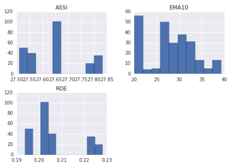
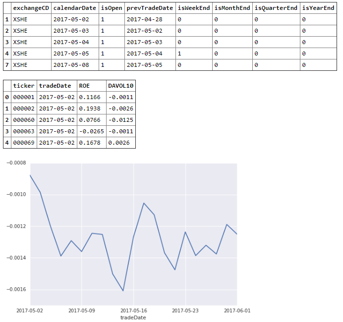
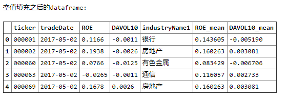
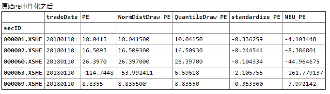
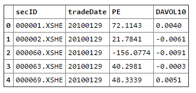
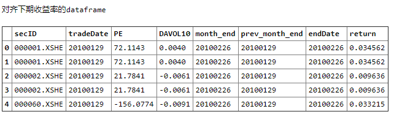
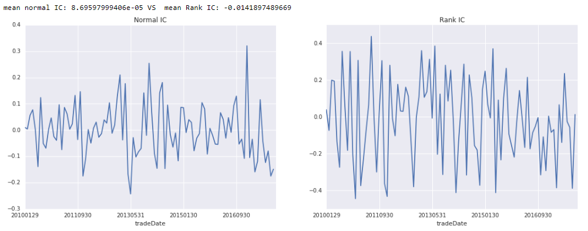

# 单因子分析

课程链接：https://uqer.datayes.com/course


本节学到的小技巧

```python
# 过滤数据，例如，我们要选出收盘价在均值以上的数据：
df[df.closePrice > df.closePrice.mean()].head(5)	

#将收盘价调整到[0, 1]区间：
print df[['closePrice']].apply(lambda x: (x - x.min()) / (x.max() - x.min())).head()
```

在A股的所有股票中找到沪深300的成分股，查出对应的PE值

用极大似然估计估计样本点的均值和方差.


单因子分析

Q: 基于因子的投资为什么这么流行？
A: 方法论相对来说科学、路径可控
​    
Q: 为什么要做因子分析？
A: 用以了解刻画涨跌相关的某一个维度的影响力


## 单因子检验的基本流程

#### 1、因子数据的获取与观察
可以尝试用describe，hist函数直接观察
如果是多个股票，可以通过时间序列的方式来看因子的分布
#### 2、数据的初步处理
- 空值处理（- 填充0值，填充行业值（均值、中位数等），其它）
- 极值处理 (根据标准差处理,根据分位数处理 直接用uqer提供的winsorize函数
     ​    详细说明：https://uqer.io/help/api/#winsorize去极值)
- 标准化
- 中性化


#### 3、看因子效果
- 分位数分组回测
- 看IC值
  选取因子主要依据的标准为：超额收益的长期性和稳定性，清晰的驱动逻辑，与其他因子的低相关性，可复制以及投资容量。

##### 3.1 一般5分位回测就足够了
##### 3.2 看IC值

IC表示所选股票的因子值与股票下期收益率的**截面相关系数**，**通过IC值可以判断因子值对下期收益率的预测能力**
- 皮尔森相关系数： Normal IC, 因子值和收益率的相关系数
  $$
  IC_A = correlation(\vec{f_A},\vec{r})
  $$
  其中，$IC_A$代表因子A在该期的IC值，$\vec{f_A}$为该期因子A的数值，$\vec{r}$为股票下期实际收益率

  其中，$IC_A$代表因子A在该期的IC值，$\vec{f_A}$为该期因子A的数值，$\vec{r}$为股票下期实际收益率

- 斯皮尔曼相关系数：也称为秩相关系数，因子值的排名和收益率排名的相关系数
  $$
  IC_A = correlation(rank(\vec{f_A}),rank(\vec{r}))
  $$


```python
# DataAPI.MktStockFactorsDateRangeGet 获取一只股票历史上某一时间段的因子数据，field 可以选择合适的返回值
factor_frame = DataAPI.MktStockFactorsDateRangeGet(secID=u"",ticker=u"000002",beginDate=u"20170616",endDate=u"20180616",
                                                   field=['ticker','tradeDate','EMA10','ROE','ASSI'],pandas="1")
factor_frame.head(10)
# 直接看统计结果
factor_frame.describe()
# 看单个因子的分布
ax = factor_frame.hist()
```



```python
import pandas as pd

# 取沪深300成分股
# DataAPI.IdxConsGet 获取国内外指数的成分股
# 关于其他的证券市场通用的指数代码，见下面网址的详细介绍
# https://uqer.datayes.com/data/browse/110/110002/?page=1
hs300_frame = DataAPI.IdxConsGet(secID=u"",ticker=u"000300",isNew=u"",intoDate=u"",field=u"",pandas="1")
hs300_frame[hs300_frame.isNew==1]
# list格式的300个股票
tickers = list(hs300_frame.consTickerSymbol.values)

# 取该300个股票2017-05-01到2017-06-01的因子值
# 先取交易日历
# DataAPI.TradeCalGet 记录交易所在日历日期当天是否开市的信息，XSHG,XSHE分别代表上交所和深交所
calendar_frame = DataAPI.TradeCalGet(exchangeCD=u"XSHG,XSHE",beginDate=u"20170501",endDate=u"20170601",field=u"",pandas="1")
# 只取有交易的日期
calendar_frame = calendar_frame[calendar_frame.isOpen==1]
print calendar_frame.head().to_html()
factor_frame_list = []
# # 遍历每一天，拿到因子数据
for tdate in calendar_frame.calendarDate.values:
    factor_frame = DataAPI.MktStockFactorsOneDayGet(tradeDate=tdate,ticker=tickers,field=["ticker",'tradeDate','ROE', 'DAVOL10'],pandas="1")
    # 将dataframe按照列表的形式上下拼接
    factor_frame_list.append(factor_frame)

# print factor_frame_list[:4]
# 合并所有天的因子值
tfactor_frame = pd.concat(factor_frame_list)
print tfactor_frame.head().to_html()

# 画图展示
ax = tfactor_frame.groupby(['tradeDate'])['DAVOL10'].mean().plot()

factor_frame1 = tfactor_frame.copy()
```



```python
# 示例：用行业均值来对空值进行填充

# 第一步，拿到股票对应的行业，以申万一级行业为例

# DataAPI.EquIndustryGet，获取股票所属行业分类，010301-证监会行业V2012、010303-申万行业、010314-中证行业
sw_map_frame = DataAPI.EquIndustryGet(industryVersionCD=u"010303", industry=u"", secID=u"", ticker=u"", intoDate=u"",field=[u'ticker', 'secShortName', 'industry', 'intoDate', 'outDate', 'industryName1','isNew'], pandas="1")
sw_map_frame = sw_map_frame[sw_map_frame.isNew == 1]

print sw_map_frame.head(10).to_html()

# 第二步，根据股票代码，将行业名称和因子值进行合并
factor_frame = factor_frame1.merge(sw_map_frame[['ticker','industryName1']], on=['ticker'], how='left')
print u'因子值合并行业之后的dataframe:\n'
print factor_frame.head().to_html()

# 第三步，得到各个行业的因子均值(注意这里只是利用的沪深300的成分股求的均值，并没有包括行业中的所有股票)
mean_factor_indust = factor_frame.groupby(['industryName1','tradeDate'])[['ROE', 'DAVOL10']].mean().reset_index()
print u'每天，每个行业的均值为：\n'
mean_factor_indust.rename(columns={"ROE":"ROE_mean", 'DAVOL10':"DAVOL10_mean"}, inplace=True)
print mean_factor_indust.head().to_html()

# 第四步，再将行业均值合并到因子的dataframe中
factor_frame = factor_frame.merge(mean_factor_indust,on=['tradeDate', 'industryName1'], how='left')
print u'合并行业均值之后的dataframe:\n'
print factor_frame.head().to_html()

# 第五步，填充空值
factor_frame['ROE'].fillna(factor_frame['ROE_mean'], inplace=True)
print u'空值填充之后的dataframe:\n'
print factor_frame.head().to_html()
```



```python
import numpy as np
pe =DataAPI.MktStockFactorsOneDayGet(secID=set_universe('HS300'),tradeDate=u"20180110",field=u"secID,tradeDate,PE",pandas="1").set_index('secID')
#
print "原始的因子分布"
print pe.head().to_html()

after_winsorize1 = winsorize(pe['PE'].to_dict(), win_type='NormDistDraw', n_draw=5)
pe['NormDistDraw PE'] = np.nan
pe.loc[after_winsorize1.keys(),'NormDistDraw PE'] = after_winsorize1.values()
print "标准差去极值后的因子"
print pe.head().to_html()

# 分位数去极值
after_winsorize2 = winsorize(pe['PE'].to_dict(), win_type='QuantileDraw', pvalue=0.05)
pe['QuantileDraw PE'] = np.nan
pe.loc[after_winsorize2.keys(),'QuantileDraw PE'] = after_winsorize2.values()
print '分位数去极值之后的'
print pe.head().to_html()
# pe.plot()


# 标准化
after_standardize = standardize(pe['PE'])
pe['standardize PE'] = after_standardize
print '原始PE去极值之后'
print pe.head().to_html()


# 中性化，首先需要调整数据格式，主要是把日期格式调整
# 调整数据格式
pe['tradeDate'] = pe['tradeDate'].apply(lambda x: x.replace("-", ""))
# pe.set_index(["ticker"], inplace=True)
print '数据格式调整之后'
print pe.head().to_html()

pe['NEU_PE'] = neutralize(pe['PE'], "20180110", industry_type='SW1', exclude_style_list=[])
print '原始PE中性化之后'
print pe.head().to_html()
```



```python
# 取因子值
hs300_frame = DataAPI.IdxConsGet(secID=u"",ticker=u"000300",isNew=u"",intoDate=u"",field=u"",pandas="1")
hs300_frame[hs300_frame.isNew==1]
tickers = list(hs300_frame.consTickerSymbol.values)

# 取HS300股票2010-01-01到2017-12-31的每个月月末因子值
# 先取交易日历
calendar_frame = DataAPI.TradeCalGet(exchangeCD=u"XSHG,XSHE",beginDate=u"20100101",endDate=u"20171231",field=u"",pandas="1")
# 只取月末日期
calendar_frame = calendar_frame[calendar_frame.isMonthEnd==1]
calendar_frame.head()
factor_frame_list = []
# 遍历每一天，拿到因子数据
for tdate in calendar_frame.calendarDate.values:
    factor_frame = DataAPI.MktStockFactorsOneDayGet(tradeDate=tdate,ticker=tickers,field=["secID",'tradeDate','PE', 'DAVOL10'],pandas="1")
    factor_frame_list.append(factor_frame)
# 合并所有天的因子值
tfactor_frame = pd.concat(factor_frame_list)
tfactor_frame['tradeDate'] = tfactor_frame['tradeDate'].apply(lambda x: x.replace("-",""))
tfactor_frame.head()
```



```python
print u'tfactor_frame 因子数据data:\n'
print bak_frame.head().to_html()
# 拿到收益率数据
monthly_return_frame = DataAPI.MktEqumGet(secID=u"",ticker=tickers,monthEndDate=u"",beginDate=u"20100101",endDate=u"20171231",
                                          isOpen=u"",field=["secID",'endDate','return'],pandas="1")
# 调整日期格式
monthly_return_frame['endDate'] = monthly_return_frame['endDate'].apply(lambda x: x.replace("-",""))
print u'monthly_return_frame 月度收益率data:\n'
print monthly_return_frame.head(20).to_html()

# 拿到交易日历，用来做对齐
calendar_frame = DataAPI.TradeCalGet(exchangeCD=u"XSHG,XSHE",beginDate=u"20091201",endDate=u"20171231",field=u"",pandas="1")
calendar_frame = calendar_frame[calendar_frame.isMonthEnd==1][['calendarDate', 'isMonthEnd']]
calendar_frame['calendarDate'] = calendar_frame['calendarDate'].apply(lambda x: x.replace("-",""))
# shift(1)下移
calendar_frame['prev_month_end'] = calendar_frame['calendarDate'].shift(1)
calendar_frame = calendar_frame[['calendarDate', 'prev_month_end']]
calendar_frame.rename(columns={"calendarDate":"month_end"}, inplace=True)

print u'calendar_frame 交易日历关系\n'
print calendar_frame.head().to_html()


# 将数据对齐，即tradeDate和prev_month_end数据对齐
bak_frame = bak_frame.merge(calendar_frame, left_on=['tradeDate'], right_on=['prev_month_end'], how='left')
print '对齐交易日历'
print bak_frame.head().to_html()

bak_frame = bak_frame.merge(monthly_return_frame, left_on=['secID', 'month_end'], right_on=['secID', 'endDate'], how='left')
print '对齐下期收益率的dataframe'
bak_frame.head()
```



```python
import scipy.stats as st
def calc_normal_ic(df):
    tmp_df = df.copy()
    tmp_df.dropna(inplace=True)
    return tmp_df['PE'].corr(tmp_df['return'])

# 用scipy的包计算
def calc_normal_ic_2(df):
    tmp_df = df.copy()
    tmp_df.dropna(inplace=True)
    return st.pearsonr(tmp_df['PE'], tmp_df['return'])[0]

# 用scipy的包计算
def calc_rank_ic(df):
    tmp_df = df.copy()
    tmp_df.dropna(inplace=True)
    return st.spearmanr(tmp_df['PE'], tmp_df['return'])[0]

# 计算Normal IC
normal_ic_frame = bak_frame.groupby(['tradeDate']).apply(calc_normal_ic)
print "Normal IC:"
print normal_ic_frame.head()

# 计算Rank IC
rank_ic_frame = bak_frame.groupby(['tradeDate']).apply(calc_rank_ic)
print "-"*20
print "Rank IC:"
print rank_ic_frame.head()


import matplotlib.pyplot as plt
fig = plt.figure(figsize=(18, 6))
ax1 = fig.add_subplot(121)
ax1=normal_ic_frame.plot(ax=ax1)
ax1.set_title("Normal IC")
ax1.grid(True)

ax2 = fig.add_subplot(122)
ax2 = rank_ic_frame.plot(ax=ax2)
ax2.set_title("Rank IC")
ax2.grid(True)

print "mean normal IC:",normal_ic_frame.mean(), "VS  mean Rank IC:", rank_ic_frame.mean()
```



