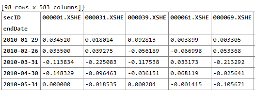

# 多因子策略


课程链接：https://uqer.datayes.com/course


本节学到的小技巧

```python
# 过滤数据，例如，我们要选出收盘价在均值以上的数据：
df[df.closePrice > df.closePrice.mean()].head(5)	

#将收盘价调整到[0, 1]区间：
print df[['closePrice']].apply(lambda x: (x - x.min()) / (x.max() - x.min())).head()
```

在A股的所有股票中找到沪深300的成分股，查出对应的PE值

用极大似然估计估计样本点的均值和方差.


单因子分析

Q: 基于因子的投资为什么这么流行？
A: 方法论相对来说科学、路径可控
​    
Q: 为什么要做因子分析？
A: 用以了解刻画涨跌相关的某一个维度的影响力


## 一、因子合成方式简介
---
### 1.1 常见合成方式
假设现有$m$个因子$f_{1}, f_{2}, ..., f_{m}$，合成后的因子为$F$，则
$$
F = \sum_{i=1}^{m}v_{i}f_{i}
$$
**等权**：每个因子配置相同的权重：
$$V = (\frac{1}{m}, \frac{1}{m}, …, \frac{1}{m})$$

**等权**：每个因子配置相同的权重：
$$
V = (\frac{1}{m}, \frac{1}{m}, …, \frac{1}{m})
$$
`优点`：直观，简单，方便	

`缺点`：没有考虑因子有效性，稳定性以及因子之间的相关性。

**IC均值加权**：取因子过去一段时间的IC的均值为权重：
$$
V = (\overline{IC_{f_{1}}}, \overline{IC_{f_{2}}}, …, \overline{IC_{f_{m}}})
$$
`优点`：考虑了因子有效性的差异	

`缺点`：没有考虑因子的稳定性以及因子之间的相关性。

**IC_IR加权**：取因子过去一段时间的IC均值除以标准差作为当期因子$f_{i}$的权重，即权重向量：
$$
V = (IR_{f_{1}}, IR_{f_{1}}, …, IR_{f_{m}})
$$
`优点`：考虑了因子有效性的差异，稳定性	

`缺点`：没有考虑因子之间的相关性。

**最优化复合IC_IR加权**：指最优化复合因子F的IC_IR后得到的最优因子权重进行加权,假设各因子的IC均值向量为$\overline{IC} = (\overline{IC_{f_{2}}}, …, \overline{IC_{f_{m}}})'$：
$$
IR_{F}=\frac{V'\overline{IC}}{\sqrt{V'\Sigma_{IC}V}}
$$


解得：


$$
V^{*}=s\Sigma_{IC}^{-1}\overline{IC}
$$
其中s为任意常数	

`优点`：考虑了因子有效性的差异，稳定性，相关性	

`缺点`：因子收益率协方差矩阵估计难度较大

**半衰期IC加权**：使用半衰的权重向量来刻画近期IC的影响：
$$
w_{t}=\frac{2^{\frac{t-N-1}{H}}}{\sum_{t=1}^{N}2^{-\frac{t}{H}}}
$$

$$
v_{f_{i}}=\sum_{t}^{N}{w_tIC_{f_{i}}^{t}}
$$

```python
# 准备数据

# 编程思路
# 1、设置股票池，这里选择沪深300
# 2、获得交易日历，取每个月的月末交易日
# 3、获得因子，通过一个for循环，得到每支股票在每个交易日的具体的某个因子（PE+PB）
# 4、获取股票月前复权行情

# 1. 设置股票池,DynamicUniverse策略框架会根据实际情况，调整当天股票池的内容。
universe = DynamicUniverse('HS300')

# 2. 设置日历
begin_date = '20100101'
end_date = '20180228'
trade_date_list = DataAPI.TradeCalGet(exchangeCD=u"XSHG", beginDate=begin_date, endDate=end_date, field=u"calendarDate,isOpen,isMonthEnd", pandas="1")
#获取'20100101'--'20180228'每个月月末交易日，并转化为list
trade_date_list = trade_date_list[trade_date_list['isMonthEnd'] == 1]['calendarDate'].tolist()
print len(trade_date_list)


# 3. 获取因子信息
factor = pd.DataFrame()

for trade_date in trade_date_list:
    # universe.preview 预览当天的股票
    current_universe = universe.preview(date=trade_date) 
    current_factor = DataAPI.MktEqudGet(secID=current_universe,tradeDate=trade_date,field='secID,tradeDate,PB,PE',pandas="1")
    factor = factor.append(current_factor)
    
print factor.head().to_html()
# pivot函数 ，将一个dataframe的记录数据整合成表格
pe = factor.pivot(index='tradeDate', columns='secID', values='PE')
pb = factor.pivot(index='tradeDate', columns='secID', values='PB')
# pe.head()

factor_dict = {'pe': pe, 'pb': pb}
# print factor_dict

# 4. 获取行情信息
# DataAPI.MktEqumAdjGet 获取股票月前复权行情，包含开高低收量价、涨跌幅、换手率等
month_return = DataAPI.MktEqumAdjGet(beginDate='20100101', endDate='20180321', field='endDate,secID,chgPct')
month_return = month_return.pivot(index='endDate', columns='secID', values='chgPct')
# shift(-1)表格数据整体往上偏移一位，后面计算因子IC值使用
# factor.secID.unique(),计算factor.secID中的唯一元素，并返回有序结果
forward_1m_ret = month_return.shift(-1).loc[:, factor.secID.unique()]
print forward_1m_ret.head().to_html()
```



```python
pee = pe.copy()
pbb = pb.copy()


# 5.1 等权：每个因子配置相同的权重。
#需要把pe与pb进行标准化，要不然直接计算没有意义，不在一个量纲

#z-score 标准化,新数据=（原数据-均值）/标准差,优矿上的standardize()也是这么计算的
def zscore_standardize(df):
    #df:DataFrame，index为日期，columns为股票代码，value为因子值
    import scipy.stats as st
    mean_v = df.mean(axis=1)
    std_v = df.std(axis=1)
    df = ((df.T-mean_v.T)/std_v.T).T
    return df

pee = zscore_standardize(pee)
pbb = zscore_standardize(pbb)
factor = (pee + pbb) / 2.
# 或者改变权重，这也是一样的道理
# factor = 0.6 * pe + 0.4 * pb
factor.head()
```


```python
# 5.2 IC加权，取因子过去一段时间的IC的均值为权重
#思路：
# a、获取每一股票每一交易日的因子值，上面的第3步
# b、计算单个因子每一交易日的IC（截面上的IC：计算所有股票某一交易日因子与收益率的相关性），对取得的因子值向下偏移1期
# c、进行12期的窗口滚动求均值，偏移一期是为了用前面12期因子IC均值来预测当天IC，并用预测值来配因子的权重
# d、各因子的IC的dataframe进行横向合并，并在每一交易日上求得每一因子IC的权重（每一因子IC值除以所有因子IC绝对值之和）
# e、把各因子乘以权重进行求和得到复合因子

import pandas as pd
import numpy as np
import scipy.stats as st
def get_rank_ic(factor, forward_return):
    """
    计算因子的信息系数
    输入：
        factor:DataFrame，index为日期，columns为股票代码，value为因子值
        forward_return:DataFrame，index为日期，columns为股票代码，value为下一期的股票收益率
    返回：
        DataFrame:index为日期，columns为IC，IC t检验的pvalue
    注意：factor与forward_return的index及columns应保持一致
    """
    common_index = factor.index.intersection(forward_return.index)#intersection获得索引的交集，共同的交易日期
    ic_data = pd.DataFrame(index=common_index, columns=['IC','pValue'])#创建一个空的dataframe

    # 计算相关系数
    for dt in ic_data.index:
        tmp_factor = factor.ix[dt]
        tmp_ret = forward_return.ix[dt]
        cor = pd.DataFrame(tmp_factor)
        ret = pd.DataFrame(tmp_ret)
        cor.columns = ['factor']
        ret.columns = ['ret']
        cor['ret'] = ret['ret']#把收益率信息合并到因子dataframe新的一列，怎么保证两个dataframe的index顺序一样
        # cor = cor[~pd.isnull(cor['factor'])][~pd.isnull(cor['ret'])]
        cor = cor[cor['factor'].notnull()][cor['ret'].notnull()]
        if len(cor) < 5:
            #如果某一交易日数据量小于5则剔除，不予计算相关系数
            continue

        ic, p_value = st.spearmanr(cor['factor'], cor['ret'])   # 计算秩相关系数RankIC
        ic_data['IC'][dt] = ic
        ic_data['pValue'][dt] = p_value
    return ic_data

# b、计算单个因子每一交易日的IC（截面上的IC：计算所有股票某一交易日因子与收益率的相关性），对取得的因子值向下偏移1期
pe_ic = get_rank_ic(pe, forward_1m_ret)
print len(pe_ic)#总的月末交易日为98，pe_ic长度也为98，说明没有那一天数据量小于5
pe_ic = pe_ic.shift(1)#向下移一行
pb_ic = get_rank_ic(pb, forward_1m_ret).shift(1)

# c、进行12期的窗口滚动求均值，偏移一期是为了用前面12期因子IC均值来预测当天IC，并用预测值来配因子的权重
pe_rolling_ic = pe_ic.rolling(12).mean()
pb_rolling_ic = pb_ic.rolling(12).mean()

# d、各因子的IC的dataframe进行横向合并，并在每一交易日上求得每一因子IC的权重（每一因子IC值除以所有因子IC绝对值之和）
all_rolling_ic_df = pd.concat((pe_rolling_ic['IC'], pb_rolling_ic['IC']), axis=1)#对pe和pb进行横向拼接
all_rolling_ic_df.columns = ['pe', 'pb']#更改列名
factor_weight = all_rolling_ic_df.divide(all_rolling_ic_df.abs().sum(axis=1), axis=0)#dataframe在列向的除法，得到每一个因子的权重

# e、把各因子乘以权重进行求和得到复合因子
factor = pe.multiply(factor_weight['pe'], axis=0) + pb.multiply(factor_weight['pb'], axis=0)
factor.head(30)
```


## 二、组合构建方式简介
---
#### 2.1 筛选法
筛选法很简单，例如，我们可以EP（市盈率倒数）来完成一个简单的组合构建：

1. 对EP按照大小进行排序
2. 选出最大的50只股票
3. 等权或流通市值加权来构建组合
4. 下次调仓，卖出不再是因子最大的前50只股票当中的股票，买入当前持仓没有，而因子值是最大的前50只股票

`优点：`
1. 简单，至少逻辑上是清晰的，原因与结果有着明确的联系
2. 稳健，只使用排序的信息，不受离群值的影响
3. 通过聚焦高Alpha值的股票来增强组合Alpha，同时，包含足够多的股票来分散风险

`缺点：`
1. 忽略了排序以外的信息
2. 不能避免Alpha中各种系统性偏差的影响。例如，价量因子选出来的股票可能都是小市值的股票。在风格上，它做不到风险准确的控制.

```python
import pandas as pd
import numpy as np
from cvxopt import matrix, solvers

# 1. 设置股票池
benchmark = 'HS300'
date = '20171229'
universe = set_universe(benchmark, date)#获得指定日期的指定成分股，相当于前面使用API获取指定日期的成分股

# 2. 获取信号(以PE为例，取倒数)
factor = 1. / (DataAPI.MktStockFactorsOneDayGet(tradeDate=date, secID=universe, field='secID,PE').set_index('secID').dropna())
factor.columns = ['EP']#删除空值pe，并获取pe的倒数
print factor.head().to_html()

# 3.1、筛选法：按数量选，等权配置
signal_1 = factor.sort_values(by='EP', ascending=False).head(50)#选取EP最大的前50只股票
signal_1['weight'] = 1./len(signal_1)
print '筛选法,按数量选，等权配置:'
print signal_1.head().to_html()

# 3.2、筛选法：按数量选，因子值配置权重
print len(factor[factor['EP'] < 0])
signal_2 = factor[factor['EP'] > 0]#不允许做空，所以确保权重大于0
signal_2['weight'] = signal_2['EP'] / signal_2['EP'].sum()
print '筛选法,按数量选，因子值配置权重:'
print signal_2.sort_values(by='weight',ascending=False).head().to_html()

# 3.3、筛选法：按分位数选，等权配置
quantile_value = factor['EP'].quantile(0.9)
signal_3 = factor[factor['EP'] > quantile_value]
print len(signal_3)
signal_3['weight'] = 1./len(signal_3)
print '筛选法,按分位数选，等权配置:'
print signal_3.head().to_html()
```


#### 2.2 分层法

升级版的筛选法。关键在于将股票分成几个互相排斥的类别，在每个类别中持有规定比例的头寸，因此来实现风险的控制。同样以EP因子为例：
1. 按照申万一级行业对股票进行分层
2. 使用业绩基准配置组合每个行业的权重
3. 在每个行业中应用筛选法的流程

`优点：`
1. 稳健
2. 分层法可以规避股票类别维度上的Alpha偏差的影响
3. 易于实现

`缺点：`
1. 无法在其他风险维度上做到精确的控制，例如市值
2. 怎么进行股票类别的划分？如果划分准确，那么风险控制合理，如果忽略了一些风险维度，那么风险控制依然失效

```python
# 4、分层法:按数量选，等权配置
#思路：
# a、对基准按行业进行分层
# b、获取成分股的行业信息
# c、获得基准成分股权重
# d、计算成分股的行业权重 = 行业里的成分股权重之和/成分股权重
# e、按指定数量在每个成分股行业里配置股票，每个股票的权重 = 行业权重/选取行业股票数量

#代码实现：
# 计算基准行业权重，由于DataAPI的限制，我们取target_date之前的最后一个月末的交易日的指数行业权重
month_trade_list = DataAPI.TradeCalGet(exchangeCD=u"XSHG,XSHE", endDate=date, field=u"calendarDate,isMonthEnd")
last_month_date = month_trade_list[month_trade_list['isMonthEnd'] == 1].iloc[-1, 0].replace('-', '')
#iloc[],纯整数索引,获取指定日期的最后一个月末交易日，并把日期中间的'-'去除'
# print last_month_date

# b、获得当前全A行业分类
industry = DataAPI.EquIndustryGet(industryVersionCD=u"010303", intoDate=last_month_date, field=u"secID,industryName1",pandas="1")
print industry.head().to_html()

# c、获得基准成份股权重
benchmark_weight = DataAPI.IdxCloseWeightGet(ticker='000300', beginDate=last_month_date, endDate=last_month_date, field=u"consID,weight")
print benchmark_weight.head().to_html()

# d1、计算基准行业权重,基准成份股权重与行业信息merge
benchmark_weight = pd.merge(benchmark_weight, industry, left_on='consID', right_on='secID',how='left')#默认how='inner'
print '基准成份股权重与行业信息:'
print benchmark_weight.head(10).to_html()

# d2、计算成分股的行业权重 = 行业里的成分股权重之和/成分股权重之和
benchmark_industry_weight = benchmark_weight.groupby("industryName1").sum()
print benchmark_industry_weight.sum()
# # print benchmark_weight['weight'].sum()
benchmark_industry_weight /= benchmark_industry_weight.sum()
benchmark_industry_weight.columns = ['industry_weight']
# print '计算成分股的行业权重 = 行业里的成分股权重之和/成分股权重之和:'
print benchmark_industry_weight.head().to_html()

# # e1、信号与行业merge,再与成分股的行业权重拼接
signal_4 = factor.sort_values(by='EP', ascending=False)#降序排列
# 拼接信号的行业
signal_4 = pd.merge(signal_4, industry, how='inner', left_index=True, right_on='secID').set_index('secID')
# 拼接行业的权重
signal_4 = signal_4.merge(benchmark_industry_weight, how='inner', right_index=True, left_on="industryName1")
print '信号与行业merge,再与成分股的行业权重拼接:'
print signal_4.head().to_html()

# e2、每个行业里面取pe前十，等权构建组合
def portfolio_weight(signal, weight_type, **kwargs):
        """
        股票配权函数，注意，如果选择了因子值加权，那么会过滤掉因子值小于0的股票
        """
        if weight_type == 'equal':
            return pd.Series(1. / len(signal), index=signal.index) * signal['industry_weight']
        elif weight_type == 'factor':
            signal = signal[signal['signal'] > 0]
            return pd.Series(signal['signal'] / signal['signal'].sum(), index=signal.index) * signal['industry_weight']
        elif weight_type == 'size':
            target_date = kwargs.get('target_date', datetime.today().strftime('%Y%m%d')) * signal['industry_weight']
            # todo
            raise Exception('当前还不支持: %s加权' % weight_type)
        else:
            raise Exception('不支持的加权方式')

signal_4 = signal_4.groupby(by='industryName1').apply(lambda x: portfolio_weight(x.head(10), 'equal')).to_frame('weight')
print '# 每个行业里面取pe前十，等权构建组合:'
print signal_4.head(15).to_html()
```


#### 2.3 组合优化
沿着不同风险维度,比如行业，规模，波动率，BETA等来描述股票特征。组合优化可以构造一个组合，使这个组合在风险控制的维度能合理的逼近业绩基准组合,同时还能在模型当中加入风险,交易成本等约束,这是分层法,筛选法不能做到的。简单的模型大概如下：
$$
max:\omega'\alpha-\lambda\omega'\Sigma\omega
$$
（目标函数是最大化组合的效用）
$$
st:min\ weight<=\omega_{i,t}<=max\ weight
$$
（个股的权重的上下限，A股不能做空，下限肯定要大于零）
$$
\sum_{k}\omega_{i,t}=1
$$
（比如这里可以看成是股票的仓位权重，1代表满仓购买）
$$
\sum_{k}|\omega_{i,t}-\omega_{i, t-1}| <= turnover\ target
$$
（换手率约束，本期权重减上期权重的绝对值之和）
$$
x_{style,lower}<=X_{style}\omega<=x_{style,upper}
$$
（市值风格的暴露大小）
$$
\large x_{indu,lower}<=X_{indu}\omega<=x_{indu,upper}
$$
（行业的暴露）
$$
0 <= \omega'\Sigma\omega <= risk
$$
（风险的约束）
$$
0 <= (\omega - \omega_b)'\Sigma(\omega - \omega_b) <= tracking\ error
$$
（跟踪误差的约束）
当然，我们还可以在模型当中加入交易成本，整数约束等功能。


`缺点：`
1. 需要输入的数据远高于其他方法，需要输入值越多，意味着更多的噪声。
2. 求解的准确性。
3. 如何准确的估计协方差矩阵？

$$
minimize:c
$$

$$
subject \ to:Ax=b
$$

$$------------------------------------------------------------------------------$$

一个简单的组合优化问题:最大化组合的预期收益率(这里用信号值代替),组合当中,个股权重下限为0,上限为0.05,全额投资.那么数学表达为:
（因为CVX包的关系，只能算最小值，这里取权重为负）
$$
minimize:-w'f
$$

$$
subject \ to:\ -w_{i}<=0
$$

$$
w_{i}<=0.05
$$

$$
全额投资sum_{i}w_{i} = 1即：
$$

$$
-sum_{i}w_{i}<=-1
$$

$$
sum_{i}w_{i}<=1
$$


```python
#组合优化的方式来解决：
#分别求出c、A、b输入矩阵，代入公式得到最优解

c = -1 * matrix(alpha)#要求alpha的最大值，转化为求-alpha的最小值

min_weight = pd.Series(0, index=alpha.index)
max_weight = pd.Series(0.05, index=alpha.index)
N = len(alpha)

# a1 个股下限约束
a1 = np.mat(-1 * np.identity(N))#全为-1的对角阵
#np.mat(a)创建矩阵
#np.identity(N),获取方阵，也即标准意义的单位阵
b = (-1 * min_weight).tolist()

# a2 个股上限约束
a2 = np.mat(np.identity(N))#全为1的对角阵
b = np.append(b, max_weight.tolist())

# a3 权重之和下限
a3 = np.mat(-1 * np.ones(N))
b = np.append(b, -1)

# a4 权重之和上限
a4 = np.mat(np.ones(N))
b = np.append(b, 1)

A = matrix(np.vstack((a1, a2, a3, a4)))#纵向相加
b = matrix(b, tc='d') # stands for type code,"d"--> real (double)

sol = solvers.lp(c, A, b)
# c代表求解问题，A代表求解条件左侧，b代表求解条件右侧
print(sol['primal objective'])
```


##### 二次规划问题

$$
minimize: 0.5x.TQx+p.Tx
$$

$$
subject\ to \ : G*x<=h
$$

$$
Ax=b
$$

$$
其中.T表示转置，P,q,G,h,A,b为输入矩阵，该问题求解采用QP算法
$$

二次型规划问题,cvxopt例子:
$$
minimize: 2x_{1}*x_{1}+ x_{2}*x_{2}+x_{1}*x_{2}+x_{1}+x_{2}
$$

$$
subject\ to \ : x_{1} >=0
$$
$$
x_{2} >=0
$$

$$
x_{1} +  x_{2} = 1
$$

```python
from cvxopt import matrix, solvers

Q = 2*matrix([[2, .5], [.5, 1]])#
p = matrix([1.0, 1.0], (2,1))#
G = matrix([[-1.0,0.0],[0.0,-1.0]])#x1与x2的系数矩阵
h = matrix([0.0,0.0])
# （1,2）表示1行2列
A = matrix([1.0, 1.0], (1,2))
b = matrix(1.0)

sol=solvers.qp(Q, p, G, h, A, b)
print(sol['x'])
print(sol['primal objective'])
```


## 课程作业


1. 补充流通市值加权的组合构建方式？
2. 组合优化当中，股票收益率的协方差矩阵估计的方式有哪些，哪种更好？


```python
# 问题1
import pandas as pd
import numpy as np
import scipy as sp
from datetime import datetime, timedelta
# from sklearn.covariance import LedoitWolf
from CAL.PyCAL import *

#1.1 初始设置
benchmark = 'HS300'
date = '20180606'
universe = set_universe(benchmark, date)
#1.2 获取信号(以PE为例)
factor = 1. / DataAPI.MktStockFactorsOneDayGet(tradeDate=date, secID=universe, field='secID,PE').set_index('secID').dropna()
factor.columns = ['EP']
#1.3 流通市值数据的获取
neg_market_value = DataAPI.MktEqudAdjGet(tradeDate=date, secID=universe, field='secID,negMarketValue').set_index('secID').dropna()['negMarketValue']

# 去极值，避免极值的影响导致某些个股权重过大
# neg_market_value = winsorize(neg_market_value) 
neg_market_value = winsorize(neg_market_value, win_type='QuantileDraw', pvalue=0.05) 

print '去极值之后的数据长度：',len(neg_market_value)
mean = neg_market_value.mean()
std = np.std(neg_market_value)
print '3sigma去极值之后的均值和标准差：',mean,std
print '3sigma去极值之后的最小值，最大值：',neg_market_value.min(),neg_market_value.max()
neg_market_value.plot()
# #流动市值数据是用来给因子配权重使用的，所以最大值，最小值发生改变并不会改变某个区间的权重


# 1.4. 筛选法
# 1.4.1 按数量选择:排名在40-50之间的股票
signal = factor.sort_values(by='EP', ascending=False).merge(neg_market_value.to_frame('neg_market_value'), right_index=True, left_index=True)
print signal.head().to_html()

use_stock = signal.iloc[39:49]# 选出'EP'按降序排列的40-50之间的股票
profolio_weight = use_stock['neg_market_value'] / use_stock['neg_market_value'].sum()# 用流动市值配置权重
print '筛选法，按数量排序股票数量：',len(profolio_weight)
print profolio_weight.to_frame('weight').head().to_html()

# 1.4.2 按分位数选:排名在60-70分位数的股票
use_stock = signal[(signal['EP'] <= signal.quantile(0.7)['EP']) & (signal['EP'] >= signal.quantile(0.6)['EP'])]
# 选出'EP'按降序排列的分位数在60-70之间的股票
profolio_weight = use_stock['neg_market_value'] / use_stock['neg_market_value'].sum()# 用流动市值配置权重
print '筛选法，按分位数选股票数量：',len(profolio_weight)
print profolio_weight.to_frame('weight').head().to_html()
```


```python
# 1.5 分层法，按行业进行分层，用流动市值配置权重
#思路：
# a、对基准按行业进行分层
# b、获取成分股的行业信息
# c、获得基准成分股权重
# d、计算成分股的行业权重 = 行业里的成分股权重之和/成分股权重
# e、按指定数量在每个成分股行业里配置股票，每个股票的权重 = 行业权重/选取行业股票数量

#代码实现：
# 计算基准行业权重，由于DataAPI的限制，我们取target_date之前的最后一个月末的交易日的指数行业权重
month_trade_list = DataAPI.TradeCalGet(exchangeCD=u"XSHG,XSHE", endDate=date, field=u"calendarDate,isMonthEnd")
last_month_date = month_trade_list[month_trade_list['isMonthEnd'] == 1].iloc[-1, 0].replace('-', '')
#iloc[],纯整数索引,获取指定日期的最后一个月末交易日，并把日期中间的'-'去除'
# print last_month_date

# b、获得当前全A行业分类，这部分数据也最好之前缓存下来，便于下次使用
industry = DataAPI.EquIndustryGet(industryVersionCD=u"010303", intoDate=last_month_date, field=u"secID,industryName1",pandas="1")
print '获得当前全A股行业分类:'
print industry.head().to_html()

# c、获得基准成份股权重，这部分数据最好之前缓存下来，便于下次使用
benchmark_weight = DataAPI.IdxCloseWeightGet(ticker='000300', beginDate=last_month_date, endDate=last_month_date, field=u"consID,weight")
print '获得基准成份股（沪深300）权重:'
print benchmark_weight.head().to_html()

# d1、计算基准行业权重,基准成份股权重与行业信息merge
benchmark_weight = pd.merge(benchmark_weight, industry, left_on='consID', right_on='secID',how='left')#默认how='inner'
print '基准成份股权重与行业信息:'
print benchmark_weight.head().to_html()

# d2、计算成分股的行业权重 = 行业里的成分股权重之和/成分股权重之和
benchmark_industry_weight = benchmark_weight.groupby("industryName1").sum()
print '计算基准成分股行业权重:'
print benchmark_industry_weight.sum()
# print benchmark_weight['weight'].sum()
benchmark_industry_weight /= benchmark_industry_weight.sum()
benchmark_industry_weight.columns = ['industry_weight']
print '计算成分股的行业权重 = 行业里的成分股权重之和/成分股权重之和:'
print benchmark_industry_weight.head().to_html()

# e1、流动市值与行业merge,再与成分股的行业权重拼接
signal_4 = pd.merge(signal, industry, how='inner', left_index=True, right_on='secID').set_index('secID')
signal_4 = signal_4.sort_values(by='EP', ascending=False)
signal_4 = signal_4.merge(benchmark_industry_weight, how='inner', right_index=True, left_on="industryName1")
print '流动市值与行业merge,再与成分股的行业权重拼接:'
print signal_4.head().to_html()


# e2_1、每个行业取前5支股票，流通市值加权
def weight_stock(signal, field):
    return pd.Series(signal[field] / signal[field].sum(), index=signal.index) * signal['industry_weight']

portfolio_weight = signal_4.groupby(by='industryName1').apply(lambda x: weight_stock(x.iloc[:5], 'neg_market_value')).to_frame('weight')
print portfolio_weight.head(10).to_html()

# e2_2、每个行业取分位数在60，80之间的股票，流通市值加权
portfolio_weight_quantile = signal_4.groupby(by='industryName1').apply(lambda x: weight_stock(x[(x['neg_market_value'] <= x.quantile(0.8)['neg_market_value']) & (x['neg_market_value'] >= x.quantile(0.6)['neg_market_value'])], 'neg_market_value')).to_frame('weight')
print portfolio_weight_quantile.head(10).to_html()
```


### 问题2、组合优化中，股票收益协方差矩阵的估计方法

#### 2.1 样本协方差矩阵
样本协方差矩阵要估计的参数为N*(N+1)/2个，而总样本量为N * T，事实上的情况是，由于收益序列的不平稳性，我们不会取太长时间，但是我们的股票集合却很大。这时候，我们估计的参数很不准确，得到的矩阵是病态的，没法直接用

* 样本协方差矩阵还有可能导致我们组合优化后，股票的权重过于集中，达不到分散化的要求

#### 2.2 结构化风险模型
##### 2.2.1 多因子模型
我们主要介绍的是结构化风险模型。股票的收益率可以归结为由一些影响所有股票的共同因子和仅与该支股票相关的特异因子所解释。更具体的说：

$$
r_{n}=\sum_{k}X_{nk}f_{k}+u_{n}
$$

更一般地：
$$
R=XF+u
$$

其中：$X_{nk}$表示第n只股票在因子k上的暴露，$f_{k}$表示因子收益率，$u_{n}$表示第n支股票的特质收益率，而$R$则表示收益率构成的向量，$X$是因子暴露矩阵。我们从上式中便得到了组合股票之间的协方差矩阵为：
$$
V=X\Sigma X'+\Delta
$$

组合的标准差即为：
$$
\sigma_{p}=\sqrt{\omega'(X\Sigma X'+\Delta)\omega}
$$

式中，$\Sigma$表示k\*K的因子收益率协方差矩阵，$\omega$表示股票权重向量，$\Delta$表示n\*n的特质收益率协方差矩阵，我们假设任意两支股票之间的特质收益率之间互不相关，所以这是一个对角矩阵，同时我们假设特质收益率与因子收益率之间也互不相关。因子收益率我们可以通过回归获得，注意这是一个横截面的多元回归，当然也不是就做个简单的线性回归，还有很多细节的地方要处理，反正Barra卖的那么贵总是有理由的，有些处理方法他们也不说。优矿的大大们已经把这些工作全都做好了，提供了下面9个风险模型的接口供使用：
1. 因子暴露数据 `DataAPI.RMExposureDayGet`
2. 因子收益数据 `DataAPI.RMFactorRetDayGet`
3. 特质收益数据 `DataAPI.RMSpecificRetDayGet`
4. 风险因子协方差矩阵表(日级别) `DataAPI.RMCovarianceDayGet`
5. 风险因子协方差矩阵表(short类型) `DataAPI.RMCovarianceShortGet`
6. 风险因子协方差矩阵表(long类型) `DataAPI.RMCovarianceLongGet`
7. 特质风险表(day类型) `DataAPI.RMSriskDayGet`
8. 特质风险表(short类型) `DataAPI.RMSriskShortGet`
9. 特质风险表(long类型) `DataAPI.RMSriskLongGet`

那风险模型强大在哪呢：前面我们说了，对于一个由N支股票构成的组合，我们需要估计$\frac{N(N+1)}{2}$个参数，那么假设我们现在有2000支股票的协方差矩阵，这意味着我们需要估计2001000个独立的参数，如果我们真的那么天真的按照历史收益率数据一个个去计算，得到的协方差矩阵也是非常病态的，很容易受到噪声的影响。那我们再看结构化风险模型需要估计多少个参数，优矿选择了39个风险因子，所以因子收益率协方差矩阵需要估计的参数才780个，大大的降低了估计的难度。


##### 2.2.2 怎么寻找这些因子？
* 基本面因子：同一行业的股票存在同涨同跌的现象（行业因子），小市值的股票可能同涨同跌（风格因子），这些都可能是股票收益率的可能影响因素，也是我们组合风险的潜在原因。

* 统计因子：行业因子，风格因子，都有明确的含义，但是，用哪些因子没有定论，事实上，不同股票池，对应的风格因子并不完全一样。为了避免这样的误差，我们可以通过统计学里面因子分析当中的主成分法，从样本的协方差矩阵去发现那些隐含的因子。主成分因子的含义可能难以理解，这可能也是我们不用这类模型的原因。

* 宏观因子：股票市场和外部经济的关系存在应该某种关联，宏观因子试图去捕捉这种关联。例如：股票收益率与债券市场的收益率的关联，油价变动，汇率的变化，工业产量等等。这类因子有些比较严重的缺陷：
  1. 滞后性。因子计算的方式类似于股票的Beta，但是与Beta不同的是，这些宏观变量的数据可能是月度，或者季度更新。我们估计一般基于过去多年的数据来进行，这可能会导致我们这些估计不能准确的描述现状
  2. 宏观数据一般是政府部门采集，而不能在市场中直接获得，因此其质量难以保证。


#### 2.3 压缩估计
* 从统计的角度来说，样本协方差的估计完全依赖于数据，而先验的协方差矩阵可以来源于主观的判断、历史经验或者模型。样本协方差矩阵是无偏的，但是有大量的估计误差。而先验的协方差矩阵由于具有严格的假设，因此其设定存在偏差，但是其待估的参数少，所以估计误差也小。事实上，当股票数量很多时，样本协方差矩阵不一定可逆，即使它可逆，协方差矩阵的逆矩阵也不是协方差矩阵逆矩阵的无偏估计，实际上在正态分布假设下有：
  $$
  E(\hat{\Sigma^{-1}}) = \frac{T}{T-M-2}\Sigma^{-1}
  $$
  
  这时候，如果T表示观察的期数，M表示股票数量，这时候，如果T和M很接近，那就会给模型带来很大的偏误。
* 协方差的压缩估计量可以表示为样本协方差矩阵和结构化模型的线性组合，即：

  $$
  \hat{\Sigma_{shrink}}=\rho F+(1-\rho)\hat{\Sigma}
  $$
  
  其中$F$为压缩目标，$\hat{\Sigma}$为样本协方差矩阵，$\rho$为压缩强度
* 压缩估计量的关键在于压缩强度的确定，可以通过一定的损失函数来估计压缩强度。Ledoit&Wolf(2013)使用协方差矩阵压缩估计量与真实协方差矩阵之间的距离来作为损失函数，压缩强度则可以最小化损失函数求解得出。而压缩目标的选择有以下形式进行参考：
  * Ledoit(2004) 单参数形式，可以表示为方差乘以一个单位矩阵
  * Ledoit(2003b) CAPM单因子结构化模型估计
  * Ledoit(2003a) 平均相关系数形式