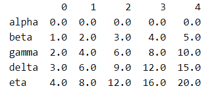
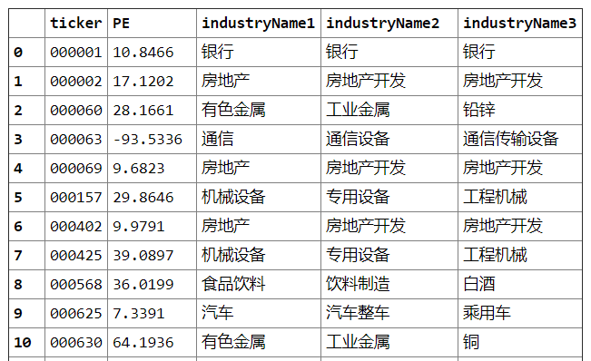
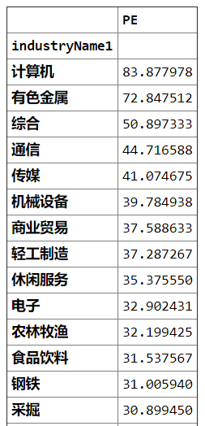
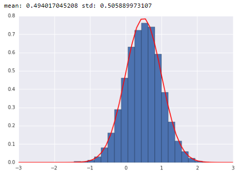
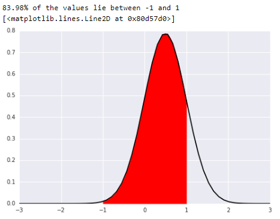
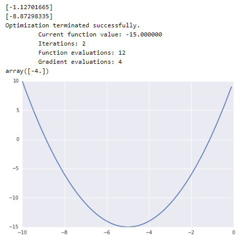
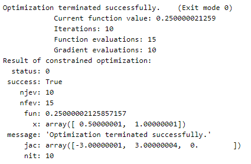
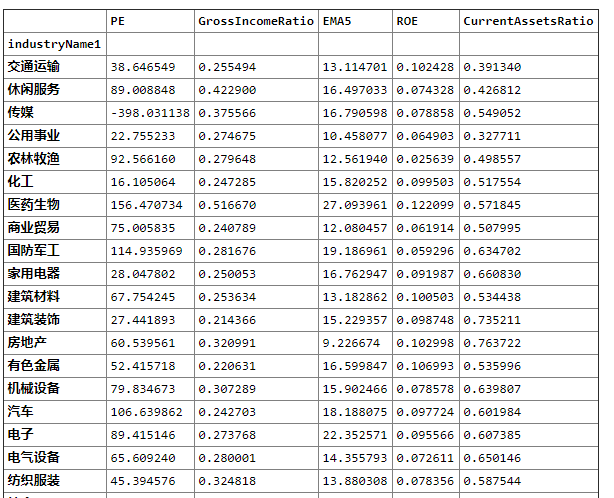
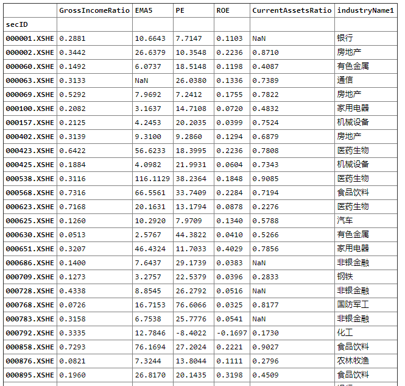
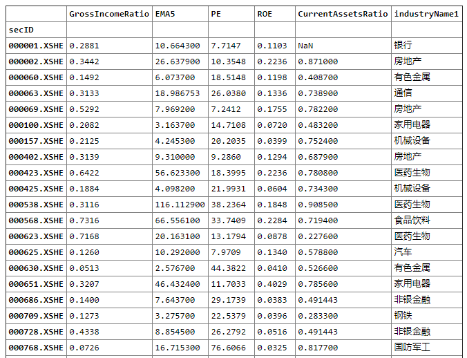

# 01.Python入门

课程链接：https://uqer.datayes.com/course


本节学到的小技巧

```python
# 过滤数据，例如，我们要选出收盘价在均值以上的数据：
df[df.closePrice > df.closePrice.mean()].head(5)	

#将收盘价调整到[0, 1]区间：
print df[['closePrice']].apply(lambda x: (x - x.min()) / (x.max() - x.min())).head()
```

在A股的所有股票中找到沪深300的成分股，查出对应的PE值

用极大似然估计估计样本点的均值和方差.

### 基础知识


容器，就是装数据的器具，它主要包括序列和词典，其中序列又主要包括列表、元组、字符串等
数据结构：列表(list)，元组(tuple)，字典(dict), set

数据的常见操作：增删查改

取数据的方法：下标或者切片

tuple不可改变，只能传输数据

字典，使用key-value对存储，键—值”映射的结构

set是不重复元素集，是无序的


```python
a = [1,2,3,4,5]
type(a)
a[-1]
a[-3:]
#增加元素
a.append(6)
a
#删除元素
del a[1]
a
b =(1,2,3,4,5)
len(b)

# 序列的切片与索引
b=list('hello')
b[2:4]=list('yy')
# 返回a列表中，元素m第一次出现的索引位置
a.index('e')
c = {'0001':1,'0002':2,'0003':3}
type(c)
#读取dict
c['0001']
# key的范围,需要是一个长度不变的序列，那么就不能用list作为输入
c[('a','b')] = 3
c
# set是不重复元素集
d = set([1,2,3,5,6,1,4,5,6,2])
e = set([3,4,5])
# set的应用,股票池的搭建
group1 = ['00001','00002','00003','00004','00005']
group2 = ['00002','00004']
# 序列的相加与合并
set(group1)-set(group2)
```


### **条件判断**

#### 顺序执行
if <条件1>:
​	<执行语句>
else:
​	<执行语句>

对于多条件，注意的是elseif要写成elif

```python
# 循环 for 和 while
a = 0
for i in [1,2,3,4,5]:
    a = a+i

a
# range(100) 生成 0~99
b = range(100)

# 循环中的break和continue，一般和if连用
# break 可以提前结束循环
# continue 在循环中是跳过当前循环
for i in range(10):
    if i % 2 ==0:
        continue
    print(i)

# 列表表达式
c = [i for i in range(10) if i % 2 ==0]
# 等同于
s = []
for i in range(10):
    if i % 2 ==0:
        s.append(i)
s
```


### 函数

def 函数名称(传入参数)：
​	执行语句
​    	返回结果
 	如果不写return ，python 默认返回none

```python
# 调用函数
# import math 和 from math import sqrt的区别
# import math
# math.sqrt(3)
from math import *
print sqrt(9)
print floor(32.9)
# from math import sqrt
# sqrt(3)


# 函数变量的定义域
a = 3
def myfunc(x):
    a = 1
    print(a)

myfunc(1)
# 此时打印的还是原来的变量
print(a)
```


### 类与对象

类是一个抽象的概念，它不存在于现实中的时间/空间里，类只是为所有的对象定义了抽象的属性与行为。
对象，是类的一个具体。

```python
# 定义一个类
class boy:
    gender='male'
    interest='girl'
    def say(self):
        return 'i am a boy'

peter=boy()
peter.gender
```


### pandas的基本操作

dataframe，series
Series可以简单地被认为是一维的数组。Series和一维数组最主要的区别在于Series类型具有索引（index）
dataframe 有column 和 index
查看数据常用的函数是 loc 和 iloc
如果不是需要访问特定行列，而只是某个特殊位置的元素的话，dataframe.at和dataframe.iat是最快的方式，它们分别用于使用索引和下标进行访问：
dataframe.ix可以混合使用索引和下标进行访问，唯一需要注意的地方是行列内部需要一致


```python
import numpy as np
from pandas import Series, DataFrame

s = Series(np.random.randn(5), index=['a', 'b', 'c', 'd', 'e'])
print s
s.index
# Series还可以从字典（dict）创建
d = {'a': 0., 'b': 1, 'c': 2}
s = Series(d)
print "s is a Series:"
print s

# DataFrame是一个二维的数据结构，是多个Series的集合体。我们先创建一个值是Series的字典，并转换为DataFrame
d = {'one': Series([1., 2., 3.,5.], index=['a', 'b', 'c','d']), 'two': Series([1., 2., 3., 4.], index=['a', 'b', 'c', 'd'])}
df = DataFrame(d)
print df
# dataframe.values则以数组的形式返回DataFrame的元素
print df.values

# 使用concat函数基于Serie或者DataFrame创建一个DataFrame
df = DataFrame()
index = ['alpha', 'beta', 'gamma', 'delta', 'eta']
for i in range(5):
    a = DataFrame([np.linspace(i, 5*i, 5)], index=[index[i]])
    df = pd.concat([df, a], axis=0)
print df

# DataFrame是以列作为操作的基础的，全部操作都想象成先从DataFrame里取一列，再从这个Series取元素即可。
```



```python
import numpy as np
import pandas as pd
from pandas import Series, DataFrame
# 横向最多显示200个字符
pd.set_option('display.width', 200)

df = DataAPI.MktEqudGet(secID=u"",ticker=u"",tradeDate=u"20150513",beginDate=u"",endDate=u"",isOpen="",field=u"",pandas="1")
# 查看数据的大小
print df.shape

# dataframe.describe()提供了DataFrame中纯数值数据的统计信息：
print df.describe()

df.head(5)


# 过滤数据，例如，我们要选出收盘价在均值以上的数据：
df[df.closePrice > df.closePrice.mean()].head(5)


# dataframe查找数据
df['ticker'].head(5)
# 切片 
df[0:1]
# loc 按行号取,比如可以取到某只股票的具体信息
# df.loc[1]
df.loc[1,['ticker','openPrice']]
# iloc要一直位置取
df.iloc[1,[0,1]]

# 按照布尔值定位,比如找出停牌股票
print df[df['isOpen']==0].head(5)

# 关于缺失值的处理，填充，删除
# df1.fillna(0.0) # 填充缺失值为0.0
# dropna(axis = 1，how = 'all') # 按行删
# 原始数据的中很可能存在一些数据的缺失，就如同现在处理的这个样例数据一样，处理缺失数据有多种方式。通常使用dataframe.dropna()，
# dataframe.dropna()可以按行丢弃带有nan的数据；若指定how=‘all’（默认是’any’），则只在整行全部是nan时丢弃数据；
# 若指定thresh，则表示当某行数据非缺失列数超过指定数值时才保留；要指定根据某列丢弃可以通过subset完成。


#将收盘价调整到[0, 1]区间：
print df[['closePrice']].apply(lambda x: (x - x.min()) / (x.max() - x.min())).head()
```

```python
# 在A股的所有股票中找到沪深300的成分股，查出对应的PE值

#获取所有股票当前的行业PE值，并进行排序
df1 = DataAPI.MktEqudGet(tradeDate=u"20180205",secID=u"",ticker=u"",beginDate=u"",endDate=u"",isOpen="",field=u"",pandas="1")
df1 = df1[['secID', 'ticker', 'PE']]
# 股票行业分类，isNew代表取最新的
df2 = DataAPI.EquIndustryGet(industryVersionCD=u"010303",industry=u"",secID=u"",ticker=u"",intoDate=u"",field=u"",pandas="1")
df2 = df2[df2['isNew']==1][['secID', 'ticker', 'industryName1', 'industryName2', 'industryName3']]
# 取沪深300的所有成分股
df3 = DataAPI.IdxConsGet(secID=u"",ticker=u"000300",intoDate=u"",isNew=u"",field=u"",pandas="1")
df3 = df3[df3.isNew==1][['consID', 'consTickerSymbol']]


#重新建索引
df1 = df1.set_index('secID', drop=True)  # 把之前的序号去掉
df2 = df2.set_index('secID', drop=True)
# 此时df1的索引就变成了以secID为参考的索引
# df1.index


#得到hs300的成分股的ID号
hs300 = df3['consID'].tolist()

df1 = df1.ix[hs300]
# df1

# 将两个dataframe合并，merge函数
# pd.merge，left表示以左边的dataframe为标准
#将两个dataframe合并
df_merge = pd.merge(df1, df2, how='left', on='ticker')
print df_merge.to_html()
```



```python
#统计沪深300股票的行业均值
# 申万一级行业
df_group = df_merge.groupby('industryName1').agg({'PE':'mean'}) #apply
df_group

#排序
df_group = df_group.sort_values('PE', ascending=False)
df_group
```




### numpay的基本操作


全1数据 np.ones()  随机数组 np.random.randn 对角矩阵 np.diag([1,2,3,4]),也可以取出对角元素

数组的属性 ndim（几维数组）  shape（数组的形状）  size（数组的总元素数量）  dtype（元素的数据类型） 

数组的索引,切片

数组的运算 add subtract multiply divide

numpy的广播，当两个数组不相同时，较小的数组会被广播到较大的数组中去

```python
import numpy as np
b = np.arange(10)
print b

# 注意索引要用中括号
# b[4]
# b[4:],b[:4]
# 切片是左闭右开的数组
b[4:6]

# 数组的运算
a = np.array([[1,2],[3,4]])
c = np.array([[4,5],[7,8]])
d = np.divide(c,a) #除法余数不是4舍五入，是只取小数部分
# print 'd',d
e = np.sum(a,axis = 0) #  axis = 0按行加，axis=1按列加
print e

# 广播
f = np.arange(12).reshape(4,3)
g = np.array([1,2,3])
print f
print f+g
# 矩阵的转置
# a.T
```


### Scipy的基本操作

scipy 在数值积分，统计，优化等领域提供了大量的函数，供基础科学研究使用
scipy 包括各类自模块，包括聚类的cluster,插值的interpolate，信号处理的signal，线性代数的linalg,优化的optimize和统计分布函数stats

#### 概率统计模块：stats
连续分布包括
1、均匀分布；2、正态分布；3、t分布
离散分布包括
1、伯努利分布；2、几何分布
其他连续分布可以参考文档 https://github.com/lijin-THU/notes-python/blob/master/04-scipy/04.03-statistics-with-scipy.ipynb


```python
from scipy.stats import norm
import numpy as np
import matplotlib.pyplot as plt  # 方便画图

method = dir(norm)
method = [x for x in method if (not '_' in x)]
# print method

# 随机生成一个正态分布，均值和方差均为0.5
x_norm = norm.rvs(size=5000,loc=0.5,scale=0.5)

# 用极大似然估计估计这组样本点，返回估计出来的均值和方差
x_mean,x_std = norm.fit(x_norm)
print 'mean: %s std: %s' % (x_mean,x_std)

# 直方图和概率分布密度函数的展示
h = plt.hist(x_norm,normed=True,bins=20)
x = np.linspace(-3,3,50)# 为什么是-3~3

# pdf 生成随机变量的概率密度函数
p = plt.plot(x,norm.pdf(x,loc=x_mean,scale=x_std),'r-')
```



#### 求积分模块  trapz

```python
from scipy.integrate import trapz
x1 = np.linspace(-1,1,100)
p = trapz(norm.pdf(x1, loc=x_mean, scale=x_std), x1) 
# 注意打印的format用法
print '{:.2%} of the values lie between -1 and 1'.format(p)
# fill_between 颜色填充
plt.fill_between(x1, norm.pdf(x1, loc=x_mean, scale=x_std), color = 'red')
plt.plot(x, norm.pdf(x, loc=x_mean, scale=x_std), 'k-')
```




#### 优化方法：optimize模块

定义函数 $f(x) = x^2 + 10 x + 10$，

1. 求解该函数的根
  利用求根公式可以得到两个解
2. 求解该函数的最小值
  对$f(x)$求导得到$f'(x)=2x+10$，另$f'(x)=0$得到$x=-5$。

```python
# 优化问题求解
from scipy import optimize
# 要先定义函数
def f(x):
    return x ** 2 + 10 * x + 10

# 画图
x = np.arange(-10, 0, 0.1)
plt.plot(x, f(x))
# 求解f(x)的根
print optimize.fsolve(f, 0) # 代表的是从0开始搜索，求离0最近的根1
print optimize.fsolve(f, -7) # 根2
# 求最小值
optimize.fmin_bfgs(f, 0)
# 或者
optimize.minimize(f, 0).x

# 有约束条件问题求解
# 'type': 'ineq'  代表约束条件是不等式
cons = ({'type': 'ineq', 'fun': lambda x: x + 4})
optimize.minimize(f, 0, constraints=cons).x
```




### 作业

#### 作业一

定义函数 $f(x,y)=2xy+2x-x^{2}-2y^{2}$

带有约束条件：

1. $2x-y=0$
2. $y-1\geqslant0$

求解$f(x,y)$的最大值

```python
# 问题一
import numpy as np
import scipy.stats as stats
import scipy.optimize as opt

def func(x, sign=1.0):
    """ sign表示求解最小或者最大值 """
    return sign*(2*x[0]*x[1] + 2*x[0] - x[0]**2 - 2*x[1]**2)

def func_deriv(x, sign=1.0):
    """ 定义其导数 """
    dfdx0 = sign*(-2*x[0] + 2*x[1] + 2)
    dfdx1 = sign*(2*x[0] - 4*x[1])
    return np.array([ dfdx0, dfdx1 ])


cons = ({'type': 'eq',  'fun': lambda x: np.array([2*x[0] - x[1]]), 'jac': lambda x: np.array([2.0, -1.0])},
      {'type': 'ineq', 'fun': lambda x: np.array([x[1] - 1]), 'jac': lambda x: np.array([1.0,0.0])})


res = opt.minimize(func, [-1.0, 1.0], args=(-1.0,), jac=func_deriv, constraints=cons, method='SLSQP', options={'disp': True})
print "Result of constrained optimization:"
print res
```




#### 作业二

利用DataAPI.MktStockFactorsOneDayGet 取一天的某些感兴趣的因子值，对返回的DataFrame进行增删查改的操作。该API文档参见 https://uqer.io/data/search/MktStockFactorsOneDayGet 

对上述DataFrame进行缺失值处理，缺失值按照该股票申万一级行业的均值填充。

```python
# 取沪深300的所有成分股,在18年5月28号的因子数据
# 选择销售毛利率(GrossIncomeRatio),5日EMA(EMA5),市盈率(PE),权益回报率(ROE)，流动资产比率(CurrentAssetsRatio)
Mydate = u"20180528"
Mycolumns = ['secID','GrossIncomeRatio', 'EMA5', 'PE', 'ROE','CurrentAssetsRatio']
df1 = DataAPI.IdxConsGet(secID=u"",ticker=u"000300",intoDate=Mydate,isNew=u"",field=u"",pandas="1")
df1 = df1[df1.isNew==1][['consID', 'consTickerSymbol']]
#得到hs300的成分股的ID号
hs300 = df1['consTickerSymbol'].tolist()
# 根据API调取沪深300成分股数据
df2 = DataAPI.MktStockFactorsOneDayGet(tradeDate=Mydate,secID=u"",ticker=hs300,field=Mycolumns,pandas="1")#.set_index('secID', drop=True)
# 显示形状
print df2.shape
#print df2.head(20)
# 根据API调取全市场股票的因子数据
df3 = DataAPI.MktStockFactorsOneDayGet(tradeDate=Mydate,secID=u"",ticker=u"",field=Mycolumns,pandas="1")#.set_index('secID', drop=True)
# 根据API调取全市场行业分类数据
df4 = DataAPI.EquIndustryGet(industryVersionCD=u"010303",industry=u"",secID=u"",ticker=u"",intoDate=Mydate,field=u"",pandas="1")
df4 = df4[['secID', 'ticker', 'industryName1']]#.set_index('secID', drop=True)

df_merge1 = pd.merge(df3, df4, how='left', on='secID')#.set_index('secID', drop=True)
print df_merge1.shape
df_merge1.head(20)

# 统计申万一级行业因子数据均值
df_PE_mean = df_merge1.groupby('industryName1').agg({'PE':'mean'}) #apply
df_GrossIncomeRatio_mean = df_merge1.groupby('industryName1').agg({'GrossIncomeRatio':'mean'}) #apply
df_EMA5_mean = df_merge1.groupby('industryName1').agg({'EMA5':'mean'}) #apply
df_ROE_mean = df_merge1.groupby('industryName1').agg({'ROE':'mean'}) #apply
df_CurrentAssetsRatio_mean = df_merge1.groupby('industryName1').agg({'CurrentAssetsRatio':'mean'}) #apply
# 因子数据均值的拼接
df_facor = pd.concat( [df_PE_mean, df_GrossIncomeRatio_mean, df_EMA5_mean, df_ROE_mean,df_CurrentAssetsRatio_mean], axis=1 )  
df_facor
```



```python
# 问题3，缺失值按股票的申万一级行业均值填充
# 股票行业分类，isNew代表取最新的
Mydate = u"20180528"
df5 = DataAPI.EquIndustryGet(industryVersionCD=u"010303",industry=u"",secID=u"",ticker=u"",intoDate=Mydate,field=u"",pandas="1")
df5 = df5[['secID', 'industryName1',]]#.set_index('secID', drop=True)

#将两个dataframe合并
df_merge2 = pd.merge(df2, df5, how='left', on='secID').set_index('secID', drop=True)
# 这时取到的是沪深300成分股的特定因子的数据，并且还能显示股票所处的申万行业分类
df_merge2
```



```python
Myfactors = ['GrossIncomeRatio', 'EMA5', 'PE', 'ROE','CurrentAssetsRatio']
# 取一级行业名，然后填充
for industry in df_facor.index:
    df_merge2.loc[df_merge2['industryName1'] == industry, Myfactors] = df_merge2.loc[df_merge2['industryName1'] == industry,Myfactors].fillna( df_facor.loc[industry][Myfactors])
# 通过观察，银行业的流动资产比率均为NaN，无法填充
df_merge2
```


