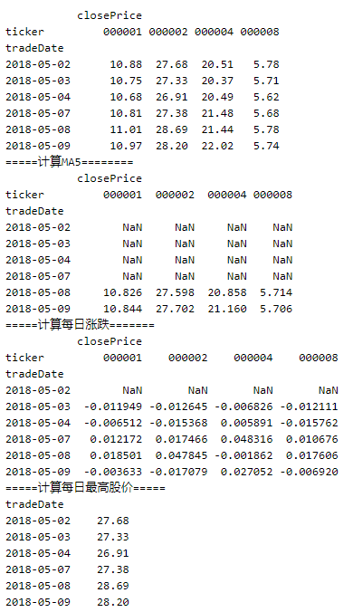

# 财报实战分析

课程链接：https://uqer.datayes.com/course


本节学到的小技巧

```python
# 过滤数据，例如，我们要选出收盘价在均值以上的数据：
df[df.closePrice > df.closePrice.mean()].head(5)	

#将收盘价调整到[0, 1]区间：
print df[['closePrice']].apply(lambda x: (x - x.min()) / (x.max() - x.min())).head()
```

在A股的所有股票中找到沪深300的成分股，查出对应的PE值

用极大似然估计估计样本点的均值和方差.


## 财报基础知识


1. 公司在上市以后需要以财报的形式公布每个季度的财务情况。
2. 一季报描述的是公司第一季度的财务状况，它的财报期为1月1日至3月31日（一般数据库里财报期记录为3月31日），必须在当年4月底之前公布。
  半年报描述的是公司半年的财务状况，财报期为1月1日至6月30日（一般数据库里财报期记录为6月30日），必须在当年8月底之前公布
  三季报描述的是公司前三季度的财务状况，财报期为7月1日至9月30日（一般数据库里财报期记录为9月30日），必须在当年10月底之前公布
  年报描述的是公司全年的财务状况，财报期为1月1日至12月31日（一般数据库里财报期记录为12月31日），必须在下一年4月底之前公布
3. 上市公司在发布财报之后，仍有可能会发布关于此财报的修正。


## PIT（Point in Time）

概念：PIT是指数据的时序正确性，即在历史上任一时间点看到的数据是那一时间点能得到的最新数据而且不是偷窥未来的数据。 举例：公司A在2017-02-03发布了2016年度净利润为100W，在2017-03-03将净利润修正为200W， 在2017-04-03又再次修正净利润为300W。 问题一：有些数据库只保存最新财报的信息，即只保存2017-04-03发布的信息，记录公司A在2016年度的净利润为300W。那么在做历史回测时，在2017-02-03～2017-04-03这个时间段内，我们不知道公司A的净利润是多少。而实际在历史上，这个数值是知道的，这就会带来严重的回测偏差。

问题二：编程时只取最新的财报数据，而不考虑历史时间点与财报发布时间点。

解决方案：使用PIT数据库，此外保证回测时编程的正确性。

```python
#导入需要的模块
import pandas as pd
import numpy as np

# 思路：
# 1、获得预定的数据
# 2、设置一个截止日期，T
# 3、筛选出，会计截止日期和会计期间长度一致的数据
# 4、剔除发布时间大于截止日期的数据
# 5、将数据按发布日期降序排列,则第一个数据就是离T日最新的数据

#假设我们想要取平安银行在2017年3月20日所能知道的2016年的净利润数据
ticker_symbol = '000001'
T = pd.to_datetime('2017-03-20')#转化日期格式
#1、获取 ticker_symbol 历史上的财报净利润数据
income= DataAPI.FdmtISGet(ticker=ticker_symbol,field=u"ticker,publishDate,endDate,fiscalPeriod,NIncome",pandas="1")
income['publishDate'] = pd.to_datetime(income['publishDate'])#转化publishDate发布日期格式
income['endDate'] = pd.to_datetime(income['endDate'])#转化endDate（会计期间截止日期，结束时间，输入格式“YYYYMMDD”,可空）格式
#以上的转化日期格式都是为了后续的读取月份和时间比较

#2、筛选出endDate(会计截止日期)的月份与fiscalPeriod(会计期间长度)相等的数据,此时的fiscalPeriod一定要转化为整形，目的是筛选出累加值，剔除公布的单季度数据。
# 注意本步骤很重要，如果不做，可能在同一日期出现两个不同的值
income = income.loc[income['endDate'].dt.month == income['fiscalPeriod'].astype(int)]

#3、剔除T日获取不到的财报数据
df = income.loc[income['publishDate'] <= T]
#4、获取离T日最近的2016年净利润数据，按发布日期降序排列,则第一个数据就是离T日最新的数据
df = df.sort_values('publishDate', ascending=False) 
print df.head(10).to_html()
df = df.loc[df['endDate'] == pd.to_datetime('20161231')]
print df.head(10).to_html()
#5、做一条件判断，如果有数据则读取第一行数据的NIncome，没有的话说明还没有公布数据
if len(df) > 0:
    n_income = df.iloc[0].loc['NIncome']
    #print('截至T日最新的2016年净利润数据为: %s' % n_income)
    print('截至{T}日最新的2016年净利润数据为: {n_income}'.format(T=T.date(), n_income=n_income))
else:
    print('截至{T}日还未发布2016年净利润数据'.format(T=T.date()))
```


## TTM(Trailing Twelve Months)
概念：以TTM净利润为例，是指已发布的最近一个财报期的单季度净利润，再加上之前三个季度的单季度净利润之和。这里财报期是指财报的会计区间，如一季报的财报期就是当年1月1日至3月31日。

举例：公司A在2017-04-03首次发布了2017年一季报，那么公司A截至2017-04-03的TTM净利润 = 2017年一季度净利润 + 2016年四季度、三季度、二季度的单季度净利润 = 2017年一季度净利润 + 2016年累计净利润 – 2016年一季度净利润。当然这里都是指截止到2017-04-03发布的最新净利润。

问题一：如何正确选取TTM中四个财报期
问题二：如何正确选取对应财报期的财报

解决方案：按照如下步骤进行操作：
这里所有财报的数据都是年初至财报期的累积数据
a.确定计算的是截止到哪天为止的TTM净利润值，记为T日
b.只取T日及之前发布的的财报
c.选取最近一个财报期的财报，记录其财报期为A
d.选取A，A之前一年的年报记为B，去年与A同期的财报记为C
e.截至T日TTM净利润 = A中净利润 + B中净利润 – C中净利润

```python
#计算TTM值
import pandas as pd
from dateutil.relativedelta import relativedelta

#0、确定计算哪只股票截止到哪天为止的TTM净利润值，记为T日
T = pd.to_datetime('2017-05-20')
ticker_symbol = '000001'

#1、获取财报数据，此部分与之前PIT一样处理
income= DataAPI.FdmtISGet(ticker=ticker_symbol, beginDateRep="2016-01-01",field=u"ticker,publishDate,endDate,fiscalPeriod,NIncome",pandas="1")
income['publishDate'] = pd.to_datetime(income['publishDate'])
income['endDate'] = pd.to_datetime(income['endDate'])

#2、只取T日及之前发布的的财报,选取发布的累计值信息
income = income.loc[income['publishDate'] <= T]
df = income.loc[income['endDate'].dt.month == income['fiscalPeriod'].astype(int)]

#3、排序、去重，选取最近一个财报期的财报，记录其财报期为A
df = df.sort_values(['endDate', 'publishDate'], ascending=[False, False]).drop_duplicates(subset=['endDate'], keep='first')
print df.to_html()
latest_date = df.iloc[0].loc['endDate']
print('最近一个已发布的财报期: %s' % latest_date.date())

#4、选取A，A之前一年的年报记为B，去年与A同期的财报记为C
last_year_end_date = pd.to_datetime(str(latest_date.year - 1) + '1231')#有没有更好的方法实现
last_same_season_end_date = latest_date-relativedelta(years=1)
print('最近一个已发布的财报期的上一年财报期为： %s' % last_year_end_date.date())
print('最近一个已发布的财报期的上一年同期财报期为： %s' % last_same_season_end_date.date())

#5、获取A、B、C中的净利润数据
df = df.set_index('endDate')
print df.to_html()
income_this_season = df.loc[latest_date.date()].loc['NIncome']
income_last_year = df.loc[last_year_end_date.date()].loc['NIncome']
income_last_same_season = df.loc[last_same_season_end_date.date()].loc['NIncome']

#6、截至T日TTM净利润 = A中净利润 + B中净利润 – C中净利润
income_TTM = income_this_season + income_last_year - income_last_same_season
print('A中净利润： %s' % income_this_season)
print('B中净利润： %s' % income_last_year)
print('C中净利润： %s' % income_last_same_season)
print('TTM净利润： %s' % income_TTM)
```


## 缺失值处理

```python
df = pd.DataFrame([['000001', pd.to_datetime('20180201'), np.nan], ['000001', pd.to_datetime('20180202'), 2], ['000001', pd.to_datetime('20180204'), np.nan]], columns=['ticker', 'tradeDate', 'factor'])
print(df)
print('===================================')
df_zero = df.fillna(0)
print(df_zero)
print('===================================')
df_ffill = df.fillna(method='ffill')
print(df_ffill)
print('===================================')
df_bfill = df.fillna(method='bfill')
print(df_bfill)
```


## ACCA因子构造


因子描述：现金流资产比和资产回报率之差（Cash flow assets ratio minus return on assets）

公式： ACCA因子 =  （TTM经营活动产生的现金流量净额 - TTM净利润） / 最新总资产

```python
import pandas as pd
import numpy as np

def get_financial_data(ticker_symbol, read_start_date='20110101'):
    #取财务数据，
    # DataAPI.FdmtCFInduGet表示获取现金流量表数据，NCFOperateA为经营活动产生的现金流量净额
    nocf=DataAPI.FdmtCFInduGet(ticker=ticker_symbol,beginDateRep=\
                           read_start_date,field=u"ticker,publishDate,endDate,fiscalPeriod,NCFOperateA",pandas="1")
    nocf['publishDate'] = pd.to_datetime(nocf['publishDate'])
    nocf['endDate'] = pd.to_datetime(nocf['endDate'])
    nocf = nocf.loc[nocf['endDate'].dt.month == nocf['fiscalPeriod'].astype(int)]
    # DataAPI.FdmtISGet代表获取会计期间的利润表数据，NIncome代表净利润
    income= DataAPI.FdmtISGet(ticker=ticker_symbol,beginDateRep=read_start_date,field=u"ticker,publishDate,endDate,fiscalPeriod,NIncome",pandas="1")
    income['publishDate'] = pd.to_datetime(income['publishDate'])
    income['endDate'] = pd.to_datetime(income['endDate'])
    income = income.loc[income['endDate'].dt.month == income['fiscalPeriod'].astype(int)]
    # DataAPI.MktStockFactorsDateRangeGet代表获取因子数据，ASSI代表获得对数总资产
    ta = DataAPI.MktStockFactorsDateRangeGet(ticker=ticker_symbol,beginDate=read_start_date,field=u"ticker,tradeDate,ASSI",pandas="1")
    ta['tradeDate'] = pd.to_datetime(ta['tradeDate'])
    # 转化成实际的总资产数
    ta['TotalAssets'] = np.exp(ta['ASSI'])
    ta = ta.drop('ASSI', axis=1)
    
    return nocf, income, ta

def get_statement_date(latest_date):
    #获取去年及去年同期财报的endDate
    year = latest_date.year
    month = latest_date.month
    if month in [6, 9]:
        day = '30'
    else:
        day = '31'
    if month < 10:
        month = '0' + str(month)
    else:
        month = str(month)
    last_year_end_date = pd.to_datetime(str(year - 1) + '1231')
    last_same_season_end_date = pd.to_datetime(str(year - 1) + month + day)
    #用以下日期推倒方式更为高效
    #last_year_end_date = pd.to_datetime(str(latest_date.year - 1) + '1231')
    #last_same_season_end_date = pd.to_datetime(int(latest_date.strftime('%Y%m%d')) - 10000, format='%Y%m%d')
    return last_year_end_date, last_same_season_end_date
    
def get_ttm(df, T, col_name):
    #根据历史财报数据df，截止日期T，财务指标名（即净利润还是营收等），构造截至T日的TTM财务指标
    df = df.loc[df['publishDate'] <= T].copy()
    # 找到最新的会计发布日期
    df = df.sort_values(['endDate', 'publishDate'], ascending=[False, False])
    latest_date = df.iloc[0].loc['endDate']
    last_year_end_date, last_same_season_end_date = get_statement_date(latest_date)
    # 确定好财报的endDate后，要在df中尝试匹配
    value_this_season = df.loc[df['endDate'] == latest_date]
    if len(df) > 0:
        value_this_season = value_this_season.iloc[0].loc[col_name]
    else:
        value_this_season = np.nan
    value_last_year = df.loc[df['endDate'] == last_year_end_date]
    if len(value_last_year) > 0:
        value_last_year = value_last_year.iloc[0].loc[col_name]
    else:
        value_last_year = np.nan
    value_last_same_season = df.loc[df['endDate'] == last_same_season_end_date]
    if len(value_last_same_season) > 0:
        value_last_same_season = value_last_same_season.iloc[0].loc[col_name]
    else:
        value_last_same_season = np.nan
    value_TTM = value_this_season + value_last_year - value_last_same_season
    return value_TTM

def get_acca():
    #ACCA因子构造
    #获取交易日期
    trade_cal = DataAPI.TradeCalGet(exchangeCD=u"XSHG",beginDate=u"",endDate=u"",field=u"isOpen,calendarDate",pandas="1")
    trade_cal = trade_cal[trade_cal['isOpen']==1]
    trade_cal['calendarDate'] = pd.to_datetime(trade_cal['calendarDate'])
    trade_cal = trade_cal.loc[trade_cal['calendarDate'] >= pd.to_datetime('20140101')]
    trade_cal = trade_cal.loc[trade_cal['calendarDate'] <= pd.to_datetime('20180212')]
    #获取股票列表
    tickera_list = ['600519', '600276']
    acca_df = pd.DataFrame(columns = ['ticker', 'tradeDate', 'acca'])
    #构造ACCA因子，这里其实用了两层for循环，股票列表和交易日期
    for ticker_symbol in tickera_list:
        #print(ticker_symbol)
        nocf, income, ta = get_financial_data(ticker_symbol, read_start_date='20110101')
        for trade_date in trade_cal['calendarDate']:
            nocf_ttm = get_ttm(nocf.copy(), trade_date, 'NCFOperateA')
            income_ttm = get_ttm(income.copy(), trade_date, 'NIncome')
            ta_now = ta.loc[ta['tradeDate'] == trade_date, 'TotalAssets']
            if trade_date == pd.to_datetime('20180212'):
                print(ticker_symbol, nocf_ttm, income_ttm, ta_now)
                print('================')
            if len(ta_now) > 0:
                ta_now = ta_now.values[0]
            else:
                ta_now = np.nan
            acca = (nocf_ttm - income_ttm) / ta_now
            # 一种行扩展数据的方式
            acca_df.loc[len(acca_df), :] = [ticker_symbol, trade_date, acca]
            #break
    acca_df = acca_df.sort_values(['tradeDate', 'ticker'])
    return acca_df

#print结果
acca_df =  get_acca()
print(acca_df.tail())
```


```python
# 直接应用优矿的TTM数据来构造ACCA因子

import pandas as pd
import numpy as np

def get_financial_data(ticker_symbol, read_start_date='20110101'):
    #取TTM现金流数据
    ncfo=DataAPI.FdmtCFInduTTMPITGet(ticker=ticker_symbol,beginDate=\
                           read_start_date,field=u"ticker,publishDate,endDate,NCFOperateA",pandas="1")
    #DataAPI.FdmtCFInduTTMPITGet根据一般工商业上市公司披露的现金流量表计算的TTM数据： 1、计算依据为该公司所有披露的财务报表 2、单位：人民币元 3、计算逻辑如下：会计期末为12-31，则取原始披露值，否则为：本期值+上年年度值-上年同期值; 取上年年度值和上年同期值的条件为：发布时间早于本期值且最新 4、由于企业可能发生借壳上市、资产重组，及本身报表的错报，导致TTM计算数据可靠性降低
    ncfo['publishDate'] = pd.to_datetime(ncfo['publishDate'])
    # ncfo = ncfo.sort_values(['ticker', 'publishDate', 'endDate'])
    # ncfo = ncfo.drop_duplicates(['ticker', 'publishDate'], keep='last')
    # keep='first' 代表有重复数据时取第一个数据
    ncfo = ncfo.sort_values(by=['endDate','publishDate'],ascending=[False, False]).drop_duplicates('endDate', keep='first')
    #取TTM净利润数据
    income= DataAPI.FdmtISInduTTMPITGet(ticker=ticker_symbol,beginDate=read_start_date,field=u"ticker,publishDate,endDate,NIncome",pandas="1")
    income['publishDate'] = pd.to_datetime(income['publishDate'])
    # income = income.sort_values(['ticker', 'publishDate', 'endDate'])
    # income = income.drop_duplicates(['ticker', 'publishDate'], keep='last')
    income = income.sort_values(by=['endDate','publishDate'],ascending=[False, False]).drop_duplicates('endDate', keep='first')
    #取净资产数据
    ta = DataAPI.MktStockFactorsDateRangeGet(ticker=ticker_symbol,beginDate=read_start_date,field=u"ticker,tradeDate,ASSI",pandas="1")
    ta['tradeDate'] = pd.to_datetime(ta['tradeDate'])
    ta['TotalAssets'] = np.exp(ta['ASSI'])
    ta = ta.drop('ASSI', axis=1)
    ta = ta.sort_values(by=['tradeDate', 'ticker'], ascending=[False, False])
    
    #merge和fillna
    df = pd.merge(ta, ncfo, left_on=['tradeDate', 'ticker'], right_on=['publishDate', 'ticker'], how='left')#how='left'因为ncfo的数据没有ta数据全，TTM现金流数据与净资产数据merge
    df = df.drop(['endDate', 'publishDate'], axis=1)#删除两列无用数据，因为后面income也有此两列
    df = pd.merge(df, income, left_on=['tradeDate', 'ticker'], right_on=['publishDate', 'ticker'], how='left')
    df = df.drop(['endDate', 'publishDate'], axis=1)
    df = df.fillna(method='bfill')#behind to fill用缺失值后面的去填充
    return df

def get_all_tickers_financial_data(ticker_list):
    df_list = []
    for ticker_symbol in ticker_list:
        df = get_financial_data(ticker_symbol)
        df_list.append(df)#把不同的ticker_symbol的数据列表加在一起形成一个三维frame,列表里面嵌套列表
    df = pd.concat(df_list, axis=0,ignore_index=True)#把列表合并成二位dataframe，这样所有股票的每一天数据都并到一个dataframe，
    # ignore_index=True 代表忽略index，直接拼接
    return df   

def get_acca():
    #ACCA因子构造
    #获取交易日期
    #获取股票列表
    ticker_list = ['600519', '600276']
    fin_data = get_all_tickers_financial_data(ticker_list)
    #构造ACCA因子
    fin_data['acca'] = (fin_data['NCFOperateA'] - fin_data['NIncome']) / fin_data['TotalAssets']
    acca_df = fin_data[['tradeDate', 'ticker', 'acca']].sort_values(by=['tradeDate', 'ticker'], ascending=[False, False])#为啥排序没起作用,因为没用对
    return acca_df

acca_df = get_acca()
print(acca_df.loc[acca_df['tradeDate'] == pd.to_datetime('20180212')])
```


## 一些常用的python数据处理技巧
#### 1.hdf文件
读取和储存速度远快于excel、csv等，特别是在上百万行数据的时候
参考资料:《Python和HDF5大数据应用》

```python
# 1、比较读取hdf文件的速度
import time
df = pd.DataFrame(np.random.randint(100, size=(10000, 10)))

t1=time.time()
df.to_hdf('test.h5', 'table')#存储文件
data = pd.read_hdf('test.h5', 'table')#读取文件
t2 = time.time()
print('hdf: ', t2-t1)

t3 = time.time()
df.to_excel('test.xlsx')
df = pd.read_excel('test.xlsx')
t4=time.time()
print('excel: ', t4-t3)
```


#### 2.unstack函数
设置两重索引，速度远快于循环和groupby方式，运算更加自由，
参考资料:http://pandas.pydata.org/pandas-docs/stable/generated/pandas.DataFrame.unstack.html

```python
# unstack 的实际用法
import pandas as pd
df = DataAPI.MktEqudGet(ticker=u"000001,000002,000004,000008",beginDate=u"20180502",endDate=u"20180509",isOpen="",field=u"ticker,tradeDate,closePrice",pandas="1")
df = df.set_index(['tradeDate', 'ticker']).unstack()
print(df)
print('=====计算MA5========')
print(df.rolling(5).mean())
print('=====计算每日涨跌=======')
print(df.pct_change())
print('=====计算每日最高股价=====')
print(df.max(axis=1))

df = df.stack().reset_index()
print(df)
```



```python
#unstack方法与groupby方法比较

import time
#获取行情数据
df = DataAPI.MktEqudAdjGet(secID=u"",ticker=u"",beginDate=u"20180101",endDate=u"20180509",field=u"ticker,tradeDate,closePrice",pandas="1")
# 按照列和交易日期默认升序排序
df = df.sort_values(['ticker', 'tradeDate'])
print df.head(20).to_html()
df_groupby = df.copy()

print('==========================================================')
#用unstack方法计算
# pct_change()计算百分数变化 
t1 = time.time()
df1 = df.set_index(['tradeDate', 'ticker']).unstack().pct_change()
df=df1.stack(dropna=False).reset_index()
df = df.sort_values(['ticker', 'tradeDate']).set_index('ticker')
print df.head(20).to_html()
t2 = time.time()
print('unstack: ', t2 - t1)

print('==========================================================')
#用groupby方法计算
t3 = time.time()
df_groupby['closePrice'] = df_groupby.groupby('ticker')['closePrice'].pct_change()
df_groupby = df_groupby.sort_values(['ticker', 'tradeDate']).set_index('ticker')
print df_groupby.head(20).to_html()
t4 = time.time()
print('groupby: ', t4 - t3)
```


#### 3.pd.Series.first_valid_index、pd.Series.last_valid_index
可以找到第一个非Nan数据出现的位置或者最后一个非Nan数据出现的位置
参考资料:http://pandas.pydata.org/pandas-docs/stable/generated/pandas.Series.first_valid_index.html

```python
df = DataAPI.MktEqudGet(ticker=u"000001,000002,000004,000008",beginDate=u"20180502",endDate=u"20180509",isOpen="",field=u"ticker,tradeDate,closePrice",pandas="1")
df = df.set_index(['tradeDate', 'ticker'])['closePrice'].unstack()
df.iloc[0, 0] = np.nan
df.iloc[0, 1] = np.nan
df.iloc[1, 1] = np.nan
df.iloc[5, 0] = np.nan
print(df)
print('='*40)
print(df.apply(pd.Series.first_valid_index, axis=0))#第一个非Nan数据出现的位置
print(df.apply(pd.Series.last_valid_index, axis=0))#最后一个非Nan数据出现的位置
```


#### 4.pd.get_dummies
进行one-hot编码，最后会变稀疏矩阵
参考资料:http://pandas.pydata.org/pandas-docs/stable/generated/pandas.get_dummies.html

```python
data = pd.DataFrame([['银行'], ['券商'], ['保险']], columns=['行业'], index=['000001', '000002', '000004'])
print(data)
pd.get_dummies(data['行业'], prefix='行业')  #prefix为前缀 
```


#### 5.pd.merge_asof
可以连接两个矩阵，即使相对应的key不一样，也会找到一个和key最接近的值进行合并。
参考资料：http://pandas.pydata.org/pandas-docs/version/0.19.0/generated/pandas.merge_asof.html

思考：不用for循环，利用merge_asof计算全量股票一段时间内的TTM营收数据。
提示：用groupby('ticker').rolling()函数找到每一行的截止当前最新财报期，用pandas列操作代替get_statement_date， 用merge_asof获取去年同期和去年整年的财务数据
